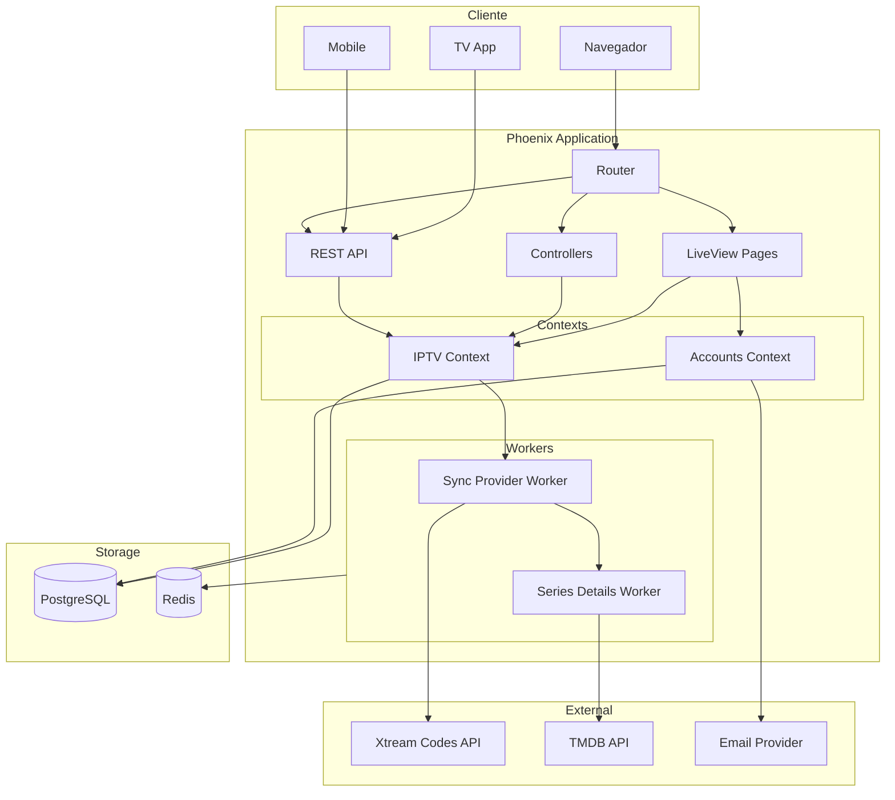
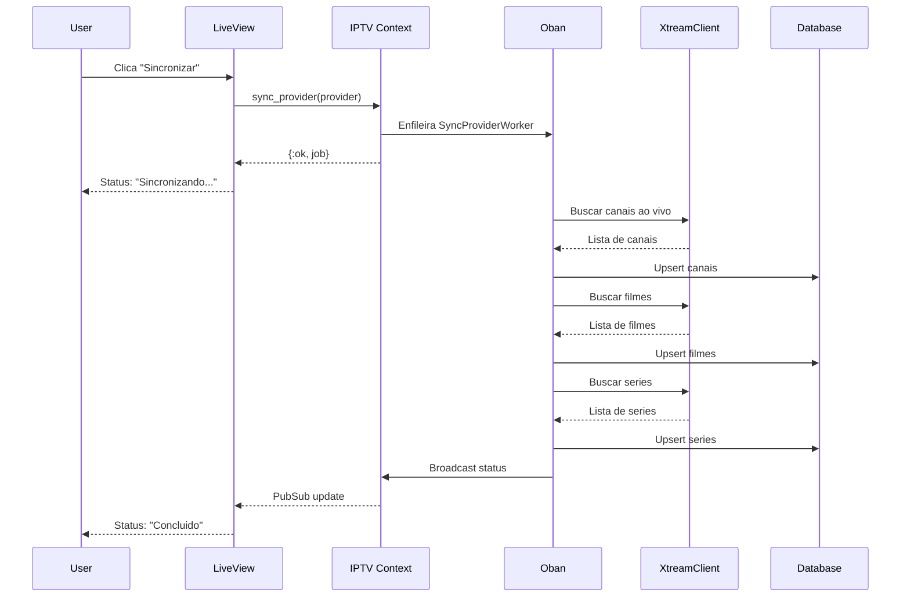
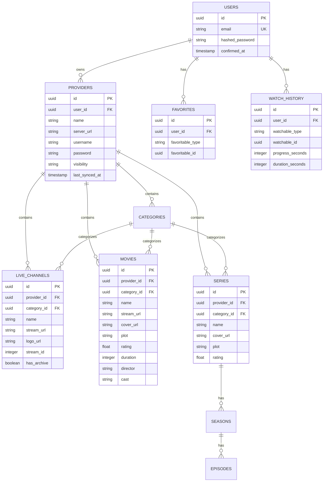
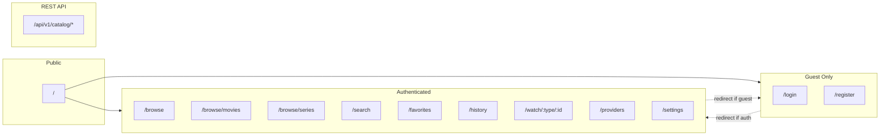

# Streamix

<div align="center">


**Uma aplicacao moderna de streaming IPTV construida com Phoenix LiveView**

[Funcionalidades](#-funcionalidades) •
[Arquitetura](#-arquitetura) •
[Instalacao](#-instalacao) •
[Uso](#-uso) •
[API](#-api) •
[Licenca](#-licenca)

</div>

---

## Sobre

O **Streamix** e uma aplicacao completa de streaming IPTV que permite gerenciar provedores, sincronizar canais de playlists M3U/Xtream Codes, assistir conteudo ao vivo e sob demanda, alem de rastrear favoritos e historico de visualizacao.

Desenvolvido com **Phoenix 1.8** e **LiveView**, oferece uma experiencia fluida e reativa em tempo real, com suporte a dispositivos moveis e uma interface moderna construida com Tailwind CSS.

---

## Funcionalidades

### Gerenciamento de Provedores IPTV
- Suporte a provedores **Xtream Codes**
- Provedores **globais** (compartilhados) e **privados** por usuario
- Sincronizacao automatica em background com **Oban**
- Rastreamento de status de sincronizacao em tempo real

### Catalogo de Conteudo
- **Canais ao Vivo**: TV ao vivo com suporte a EPG e arquivo
- **Filmes (VOD)**: Metadados completos via integracao TMDB/IMDB
- **Series**: Temporadas e episodios com progresso individual

### Player de Video
- Suporte a **HLS** e **MPEG-TS**
- Proxy de streaming com cache ETS
- Selecao de qualidade e faixas de audio/legenda
- Modo Picture-in-Picture
- Retomada de progresso

### Engajamento do Usuario
- Sistema de **Favoritos** polimorfico
- **Historico de visualizacao** com progresso
- Conteudo em destaque na pagina inicial
- Busca global em tempo real

### Autenticacao
- Login **sem senha** via magic link (email)
- Padrao de escopo do Phoenix 1.8

---

## Arquitetura

### Visao Geral do Sistema



### Fluxo de Sincronizacao de Provedor



### Modelo de Dados



### Estrutura de Rotas



---

## Stack Tecnologica

| Categoria | Tecnologia |
|-----------|------------|
| **Backend** | Elixir 1.15+, Phoenix 1.8, Ecto 3.13 |
| **Frontend** | Phoenix LiveView 1.1, Tailwind CSS v4, Alpine.js |
| **Banco de Dados** | PostgreSQL |
| **Cache/Jobs** | Redis, Oban |
| **Streaming** | HLS.js, mpegts.js |
| **HTTP Client** | Req, Mint |
| **APIs Externas** | Xtream Codes, TMDB |

---

## Instalacao

### Pre-requisitos

- **Elixir** 1.15 ou superior
- **Erlang/OTP** 26 ou superior
- **PostgreSQL** 14 ou superior
- **Redis** 6 ou superior
- **Node.js** 18+ (para compilacao de assets)

### Setup

```bash
# Clone o repositorio
git clone https://github.com/seu-usuario/streamix.git
cd streamix

# Instale as dependencias e configure o banco
mix setup

# Configure as variaveis de ambiente
cp .env.example .env
# Edite .env com suas configuracoes

# Inicie o servidor de desenvolvimento
mix phx.server
```

Acesse [`localhost:4000`](http://localhost:4000) no seu navegador.

### Variaveis de Ambiente

| Variavel | Descricao |
|----------|-----------|
| `DATABASE_URL` | URL de conexao PostgreSQL |
| `REDIS_URL` | URL de conexao Redis |
| `SECRET_KEY_BASE` | Chave secreta Phoenix (gere com `mix phx.gen.secret`) |
| `ADMIN_EMAIL` | Email do usuario admin |
| `ADMIN_PASSWORD` | Senha do usuario admin |
| `TMDB_API_TOKEN` | Token da API TMDB (opcional) |
| `STREAM_PROXY_URL` | URL base do proxy de streaming |

---

## Uso

### Comandos de Desenvolvimento

```bash
# Servidor de desenvolvimento
mix phx.server
iex -S mix phx.server  # com shell IEx

# Testes
mix test
mix test test/path/to/test.exs  # arquivo especifico
mix test --failed               # re-executar falhos

# Verificacao pre-commit
mix precommit  # compila, formata, executa testes

# Banco de dados
mix ecto.gen.migration nome_da_migracao
mix ecto.migrate
mix ecto.reset  # drop, create, migrate, seed

# Assets
mix assets.build
mix assets.deploy  # producao
```

### Docker

```bash
# Desenvolvimento com Docker Compose
docker-compose up -d

# Build para producao
docker build -t streamix .
docker run -p 4000:4000 streamix
```

---

## API

O Streamix expoe uma API REST publica para integracao com aplicativos externos (TV, mobile, etc.).

### Endpoints

| Metodo | Endpoint | Descricao |
|--------|----------|-----------|
| `GET` | `/api/v1/catalog/featured` | Conteudo em destaque e estatisticas |
| `GET` | `/api/v1/catalog/channels` | Lista de canais ao vivo |
| `GET` | `/api/v1/catalog/movies` | Catalogo de filmes |
| `GET` | `/api/v1/catalog/series` | Catalogo de series |
| `GET` | `/api/v1/catalog/search?q=termo` | Busca global |
| `GET` | `/api/v1/catalog/:type/:id/stream` | URL de streaming |

### Exemplo de Resposta

```json
{
  "data": {
    "movies": [
      {
        "id": "uuid",
        "name": "Nome do Filme",
        "cover_url": "https://...",
        "rating": 8.5,
        "duration": 7200,
        "plot": "Descricao..."
      }
    ],
    "pagination": {
      "page": 1,
      "per_page": 20,
      "total": 150
    }
  }
}
```

---

## Estrutura do Projeto

```
streamix/
├── lib/
│   ├── streamix/              # Logica de negocio
│   │   ├── accounts/          # Autenticacao de usuarios
│   │   ├── iptv/              # Contexto IPTV principal
│   │   │   ├── xtream_client.ex
│   │   │   ├── tmdb_client.ex
│   │   │   ├── stream_proxy.ex
│   │   │   └── sync.ex
│   │   └── workers/           # Jobs Oban
│   ├── streamix_web/          # Camada web
│   │   ├── live/              # Paginas LiveView
│   │   ├── controllers/       # Controllers HTTP
│   │   ├── components/        # Componentes reutilizaveis
│   │   └── router.ex
│   └── streamix_web.ex
├── assets/                    # Frontend (JS, CSS)
├── priv/repo/migrations/      # Migracoes do banco
├── config/                    # Configuracoes
├── test/                      # Testes
├── Dockerfile
└── docker-compose.yml
```

---

## Contribuicao

Este e um projeto proprietario. Contribuicoes sao bem-vindas apenas mediante autorizacao previa do autor.

Para reportar bugs ou sugerir funcionalidades, abra uma issue no repositorio.

---

## Licenca

Copyright (c) 2025 Gabriel Maia. Todos os direitos reservados.

Este software e proprietario e esta licenciado sob os termos da [Licenca Streamix](./LICENSE).

**A revenda ou redistribuicao comercial por terceiros e estritamente proibida.**

Consulte o arquivo [LICENSE](./LICENSE) para detalhes completos.

---

<div align="center">

Desenvolvido com :purple_heart: usando [Phoenix Framework](https://phoenixframework.org/)

</div>
