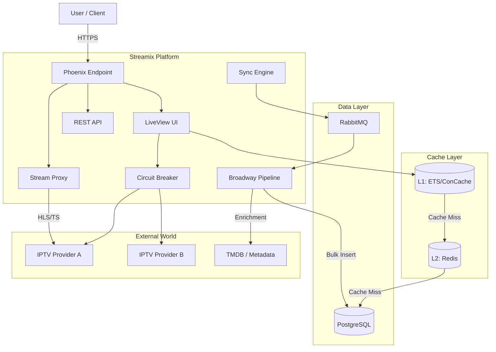
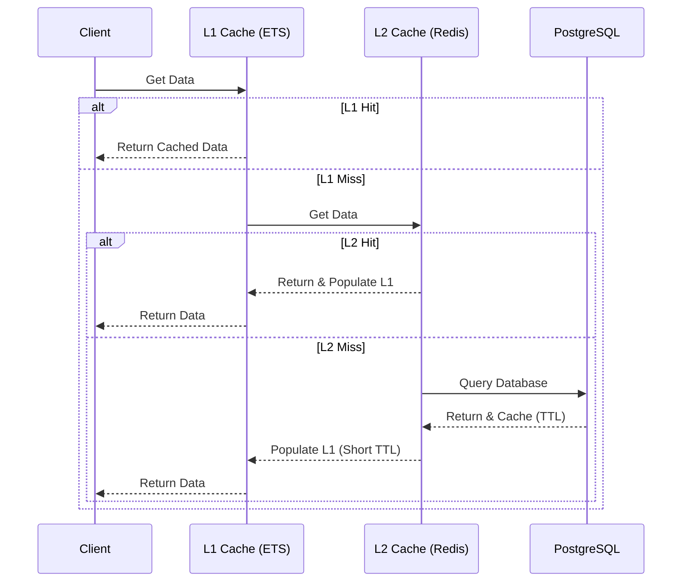
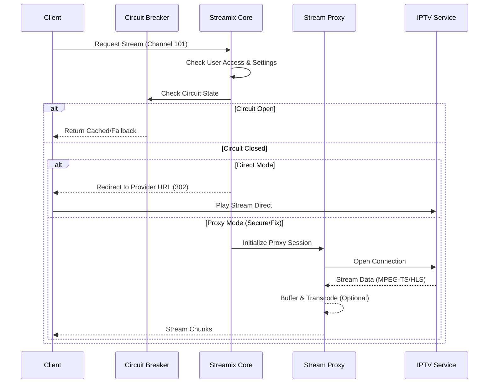

<h1 align="center">
  <br>
  
  <br>
  Streamix - Next-Gen Unified IPTV Platform
  <br>
</h1>

<p align="center">
  <strong>A premium, consolidated streaming experience bringing all your IPTV providers into one intelligent, beautiful interface.</strong>
</p>

<p align="center">
  <a href="README.pt.md">Portugues</a>
</p>

<p align="center">
  
  
  
  
  
  
  
  
  
</p>

<br>

<p align="center">
  <a href="#sparkles-features">Features</a>&nbsp;&nbsp;&nbsp;|&nbsp;&nbsp;&nbsp;
  <a href="#rocket-capabilities">Capabilities</a>&nbsp;&nbsp;&nbsp;|&nbsp;&nbsp;&nbsp;
  <a href="#computer-technologies">Technologies</a>&nbsp;&nbsp;&nbsp;|&nbsp;&nbsp;&nbsp;
  <a href="#package-installation">Installation</a>&nbsp;&nbsp;&nbsp;|&nbsp;&nbsp;&nbsp;
  <a href="#electric_plug-usage">Usage</a>&nbsp;&nbsp;&nbsp;|&nbsp;&nbsp;&nbsp;
  <a href="#memo-license">License</a>
</p>

<br>

## :sparkles: Features

### Unified Content Management

- **Multi-Provider Aggregation** - Connect unlimited Xtream Codes IPTV providers in one place
- **Intelligent Sync** - Background synchronization of Live TV, Movies, and Series
- **Global & Private Providers** - System-wide providers for all users or personal private subscriptions
- **Smart Categorization** - Automatic organization of content by genre, country, and resolution
- **Unified Search** - Search across all your providers instantly with pg_trgm optimization
- **Favorites & History** - Keep track of what you love and resume where you left off
- **Cross-Provider Playlists** - Create custom playlists mixing content from different sources
- **Cloud Drive Integration** - Seamlessly stream movies and series directly from GIndex/Google Drive
- **Metadata Enrichment** - Automatic fetching of logos, posters, and EPG data
- **EPG (Electronic Program Guide)** - Live program info with progress bars on channel cards

### Advanced Streaming Engine

- **Adaptive Stream Proxying** - Smart proxy system to bypass geo-blocks and insecure content (HLS/MPEG-TS)
- **Low-Latency Playback** - Optimized buffer settings for instant channel zapping
- **Format Intelligence** - Automatic detection and handling of m3u8 and ts stream formats
- **Bandwidth Optimization** - Smart transcoding and stream relay capability
- **Error Recovery** - Automatic reconnection strategies for unstable streams
- **Multi-Format Support** - Seamless playback of Live Streams, VOD Movies, and Series Episodes
- **Player API** - Dedicated API endpoints for external player integration
- **Next Episode Pre-fetch** - Automatically loads next episode for seamless binge-watching

### Premium User Experience

- **Cinematic UI** - Dark-mode first, glassmorphism-inspired design
- **Responsive Layouts** - Perfectly optimized for Desktop, Tablet, and Mobile
- **Instant Navigation** - Powered by Phoenix LiveView for app-like speed without page loads
- **Visual Feedback** - Micro-interactions and smooth transitions
- **Player Controls** - Full suite of controls including quality selection, audio tracks, and subtitles

### Distributed Processing

- **Broadway + RabbitMQ** - Distributed sync pipeline for high-throughput provider synchronization
- **Background Jobs** - Robust job processing with Oban for reliable task execution

### AI-Powered Features

- **Semantic Similarity** - AI-powered recommendations based on content similarity
- **Smart Search** - pg_trgm trigram search for fuzzy matching and typo tolerance

### PWA & Offline Support

- **Progressive Web App** - Install Streamix as a native-like app on any device
- **IndexedDB Caching** - Offline metadata storage for browsing without connection
- **Service Worker Updates** - Automatic background updates with user notification

### Security & Resilience

- **Circuit Breaker** - Netflix-style resilience patterns for external service calls
- **Rate Limiting** - Hammer-based protection against abuse
- **CSP Nonces** - Content Security Policy with dynamic nonces
- **Security Headers** - Comprehensive HTTP security headers

<br>

## :rocket: Capabilities

### IPTV Protocol Support

```bash
# Supported Standards:
- Xtream Codes API - Full integration with standard IPTV panels
- M3U Playlists - Advanced parsing and categorization
- EPG (XMLTV) - Electronic Program Guide synchronization
- HLS (HTTP Live Streaming) - Native .m3u8 playback
- MPEG-TS - Transport stream support via proxy
- VOD Metadata - Movie and Series information fetching
```

### Cloud Integration

```bash
# GIndex Support:
- Direct Indexing - Stream directly from Google Drive
- Secure Links - Signed URL generation with expiration caching
- Smart Scraping - Automatic folder structure parsing
```

### Content Intelligence

```bash
# Smart Features:
- Automatic provider health checks
- Stream availability monitoring
- Duplicate channel detection
- Intelligent grouped search
- Resource usage optimization (lazy loading)
- Secure credential management (Redacted in DB)
```

### Resilience Patterns

```bash
# Fault Tolerance:
- Circuit Breaker - Prevents cascade failures with open/half-open/closed states
- Multi-Layer Cache (L1+L2) - ETS (L1) + Redis (L2) for optimal performance
- Rate Limiting - Per-user and per-IP request throttling
- Connection Pooling - Finch pools for efficient HTTP connections
- Graceful Degradation - Fallback strategies when services are unavailable
```

<br>

## :art: System Architecture

### High-Level Overview


```mermaid
graph TD
    User[User / Client]

    subgraph "Streamix Platform"
        LB[Phoenix Endpoint]
        LV[LiveView UI]
        API[REST API]
        Proxy[Stream Proxy]
        CB[Circuit Breaker]
        Sync[Sync Engine]
        Broadway[Broadway Pipeline]
    end

    subgraph "Cache Layer"
        L1[(L1: ETS/ConCache)]
        L2[(L2: Redis)]
    end

    subgraph "Data Layer"
        DB[(PostgreSQL)]
        RMQ[RabbitMQ]
    end

    subgraph "External World"
        P1[IPTV Provider A]
        P2[IPTV Provider B]
        TM[TMDB / Metadata]
    end

    User -->|HTTPS| LB
    LB --> LV
    LB --> API
    LB --> Proxy

    LV --> L1
    L1 -->|Cache Miss| L2
    L2 -->|Cache Miss| DB

    LV --> CB
    CB --> P1
    CB --> P2

    Sync --> RMQ
    RMQ --> Broadway
    Broadway -->|Bulk Insert| DB
    Broadway -->|Enrichment| TM

    Proxy -->|HLS/TS| P1
```

### Cache Flow (L1 + L2)


```mermaid
sequenceDiagram
    participant C as Client
    participant L1 as L1 Cache (ETS)
    participant L2 as L2 Cache (Redis)
    participant DB as PostgreSQL

    C->>L1: Get Data
    alt L1 Hit
        L1-->>C: Return Cached Data
    else L1 Miss
        L1->>L2: Get Data
        alt L2 Hit
            L2-->>L1: Return & Populate L1
            L1-->>C: Return Data
        else L2 Miss
            L2->>DB: Query Database
            DB-->>L2: Return & Cache (TTL)
            L2-->>L1: Populate L1 (Short TTL)
            L1-->>C: Return Data
        end
    end
```

### Streaming Pipeline


```mermaid
sequenceDiagram
    participant C as Client
    participant CB as Circuit Breaker
    participant S as Streamix Core
    participant P as Stream Proxy
    participant X as IPTV Service

    C->>S: Request Stream (Channel 101)
    S->>S: Check User Access & Settings
    S->>CB: Check Circuit State

    alt Circuit Open
        CB-->>C: Return Cached/Fallback
    else Circuit Closed
        alt Direct Mode
            S-->>C: Redirect to Provider URL (302)
            C->>X: Play Stream Direct
        else Proxy Mode (Secure/Fix)
            S->>P: Initialize Proxy Session
            P->>X: Open Connection
            X-->>P: Stream Data (MPEG-TS/HLS)
            P-->>P: Buffer & Transcode (Optional)
            P-->>C: Stream Chunks
        end
    end
```

<br>

## :computer: Technologies

### Core Framework

| Technology | Version | Description |
|------------|---------|-------------|
| [Elixir](https://elixir-lang.org/) | 1.15+ | The backbone of our concurrent architecture |
| [Phoenix Framework](https://www.phoenixframework.org/) | 1.8.2+ | High-performance web interface |
| [Phoenix LiveView](https://hexdocs.pm/phoenix_live_view/) | 1.1.0+ | Real-time smooth UX |
| [OTP](https://www.erlang.org/doc/design_principles/des_princ.html) | 26+ | Fault tolerance and supervision |

### Data & Connectivity

| Technology | Version | Description |
|------------|---------|-------------|
| [PostgreSQL](https://www.postgresql.org/) | 14+ | Robust relational data storage with pg_trgm |
| [Redis](https://redis.io/) | 7+ | L2 cache and session storage |
| [RabbitMQ](https://www.rabbitmq.com/) | 3.12+ | Message broker for distributed sync |
| [Ecto](https://hexdocs.pm/ecto/) | 3.13+ | Database interaction and query composition |
| [Req](https://hexdocs.pm/req/) | 0.5+ | Powerful HTTP client for provider communication |
| [Finch](https://hexdocs.pm/finch/) | 0.19+ | HTTP client with connection pooling |
| [Bandit](https://hexdocs.pm/bandit/) | 1.6+ | Next-gen HTTP server for Elixir |

### Background Processing

| Technology | Description |
|------------|-------------|
| [Oban](https://getoban.pro/) | Robust background job processing |
| [Broadway](https://hexdocs.pm/broadway/) | Concurrent data processing pipelines |
| [ConCache](https://hexdocs.pm/con_cache/) | ETS-based L1 cache with TTL |

### Frontend & Design

| Technology | Version | Description |
|------------|---------|-------------|
| [Tailwind CSS](https://tailwindcss.com/) | v4 | Utility-first styling with modern syntax |
| [Heroicons](https://heroicons.com/) | 2.1+ | Beautiful SVG icons |
| [JS Hooks](https://hexdocs.pm/phoenix_live_view/js-interop.html) | - | Video players and advanced interactions |

### Security & Quality

| Technology | Description |
|------------|-------------|
| [Hammer](https://hexdocs.pm/hammer/) | Rate limiting and throttling |
| [Sobelow](https://hexdocs.pm/sobelow/) | Security-focused static analysis |
| [Credo](https://hexdocs.pm/credo/) | Code consistency and quality |
| [ExUnit](https://hexdocs.pm/ex_unit/) | Comprehensive testing framework |

<br>

## :package: Installation

### Prerequisites

- **[Elixir](https://elixir-lang.org/install.html)** 1.15+
- **[PostgreSQL](https://www.postgresql.org/download/)** 14+
- **[Redis](https://redis.io/download/)** 7+
- **[Node.js](https://nodejs.org/)** 20+ (for asset building)
- **[RabbitMQ](https://www.rabbitmq.com/download.html)** 3.12+ (optional, for distributed sync)

### Quick Start

1. **Clone the repository**

```bash
git clone https://github.com/gabrielmaialva33/streamix.git
cd streamix
```

2. **Configure environment**

```bash
cp .env.example .env
# Edit .env with your database, Redis, and RabbitMQ credentials
```

3. **Install dependencies**

```bash
mix deps.get
```

4. **Setup database**

```bash
mix ecto.setup
```

5. **Start the Phoenix server**

```bash
mix phx.server
```

6. **Access the Application**

Open [http://localhost:4000](http://localhost:4000) in your browser.

### Docker Option

```bash
# Build and run with Docker Compose
docker compose up -d

# Or build manually
docker build -t streamix .
docker run -p 4000:4000 streamix
```

<br>

## :electric_plug: Usage

### Provider Management

1. Navigate to **Providers** in the main menu.
2. Click **Add Provider**.
3. Enter your Xtream Codes credentials (URL, Username, Password).
4. Watch as Streamix automatically syncs your channels and VOD library.

### Watching Content

- **Live TV**: Browse by category, search for channels, and click to play instantly.
- **Movies & Series**: Explore your VOD library with rich metadata and one-click playback.
- **Favorites**: Star your top channels for quick access on the dashboard.
- **Continue Watching**: Resume movies and series exactly where you left off from your personalized dashboard.

### PWA Installation

Streamix works as a Progressive Web App for a native-like experience:

**Desktop (Chrome/Edge):**
1. Click the install icon in the address bar
2. Click "Install" in the prompt

**Mobile (Android):**
1. Open Streamix in Chrome
2. Tap the three-dot menu
3. Select "Add to Home screen"

**Mobile (iOS):**
1. Open Streamix in Safari
2. Tap the Share button
3. Select "Add to Home Screen"

<br>

## :memo: License

This project is under the **MIT** license. See [LICENSE](./LICENSE) for details.

<br>

## :handshake: Contributing

Contributions are welcome! Please feel free to submit a Pull Request.

1. Fork the project
2. Create your feature branch (`git checkout -b feature/AmazingFeature`)
3. Commit your changes (`git commit -m 'Add amazing feature'`)
4. Push to the branch (`git push origin feature/AmazingFeature`)
5. Open a Pull Request

<br>

## :busts_in_silhouette: Author

<p align="center">
  
</p>

Made with Love by **Maia**

- Email: [gabrielmaialva33@gmail.com](mailto:gabrielmaialva33@gmail.com)
- GitHub: [@gabrielmaialva33](https://github.com/gabrielmaialva33)

<br>

<p align="center">
  
</p>

<p align="center">
  <strong>Streamix v1.3.0 - Where Entertainment Meets Technology.</strong>
</p>

<p align="center">
  &copy; 2017-2026 <a href="https://github.com/gabrielmaialva33/" target="_blank">Maia</a>
</p>
