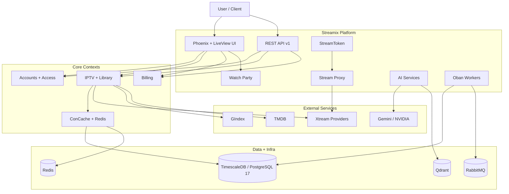
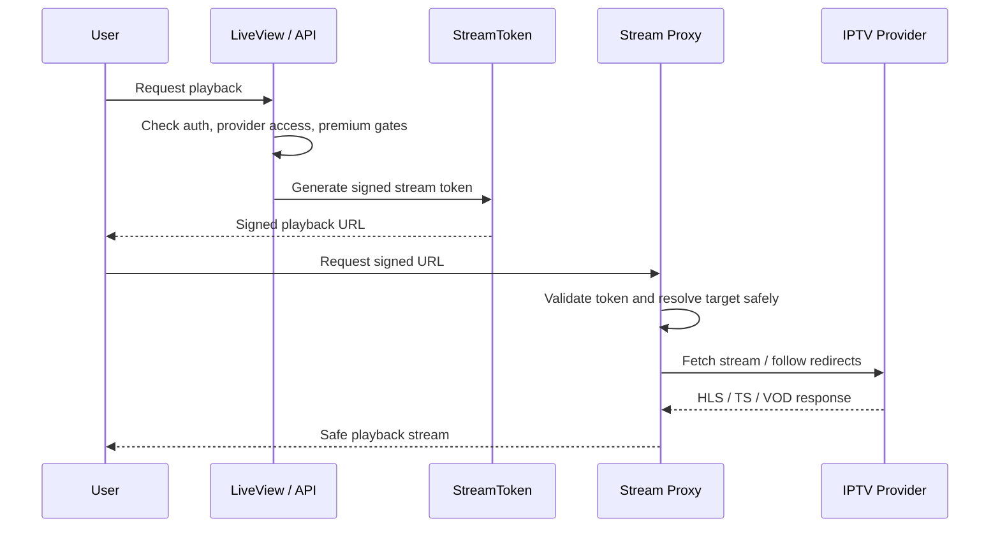

<h1 align="center">
  <br>
  
  <br>
  Streamix
  <br>
</h1>

<p align="center">
  <strong>A cinematic Phoenix + LiveView streaming platform that unifies Xtream Codes providers, optional GIndex catalogs, premium access, watch parties, and AI-assisted discovery into one polished experience.</strong>
</p>

<p align="center">
  <a href="README.pt.md">Portugues</a>
</p>

<p align="center">
  
  
  
  
  
  
  
  
  
  
</p>

<p align="center">
  <a href="#sparkles-highlights">Highlights</a>&nbsp;&nbsp;&nbsp;|&nbsp;&nbsp;&nbsp;
  <a href="#art-architecture">Architecture</a>&nbsp;&nbsp;&nbsp;|&nbsp;&nbsp;&nbsp;
  <a href="#rocket-runtime-surfaces">Runtime Surfaces</a>&nbsp;&nbsp;&nbsp;|&nbsp;&nbsp;&nbsp;
  <a href="#computer-stack">Stack</a>&nbsp;&nbsp;&nbsp;|&nbsp;&nbsp;&nbsp;
  <a href="#package-quick-start">Quick Start</a>&nbsp;&nbsp;&nbsp;|&nbsp;&nbsp;&nbsp;
  <a href="#memo-project-notes">Project Notes</a>
</p>

<br>

> [!NOTE]
> This repository contains the Phoenix backend and LiveView web app. The older standalone TV app was extracted to a
> separate repository and is no longer part of this codebase.

## :sparkles: Highlights

### Unified Streaming Platform

- **Multi-provider aggregation** for Xtream Codes catalogs
- **Optional global provider** shared across the whole system
- **Optional GIndex ingestion** for Google Drive-backed libraries
- **Live TV, movies, series, seasons, and episodes**
- **Favorites, history, and watch progress**
- **EPG sync** with now/next style queries

### Premium Product Surface

- **Premium plans and subscriptions**
- **Admin dashboard** for plans and users
- **Watch parties** with synchronized playback and room chat
- **Signed stream URLs** and credential-safe delivery
- **PWA support** plus offline metadata sync hooks
- **Dark-first UI**

### AI, Delivery, and Infra

- **Semantic search** via Gemini or NVIDIA embeddings plus Qdrant
- **Recommendations and user taste profiling** when AI services are configured
- **Phoenix stream proxy** for mixed-content and upstream credential protection
- **Live stream multiplexer** for shared upstream channel consumption
- **Circuit breaker** behavior for unstable providers
- **ConCache L1 + Redis L2** cache layering
- **Oban-first background work**, with **RabbitMQ + Broadway** as an optional path

## :fire: Why Streamix Feels Different

Streamix is not just an IPTV panel wrapper. The codebase already includes the pieces needed to behave more like a
real product surface: premium access gates, signed stream tokens, synchronized watch rooms, optional semantic
discovery, and a cinematic LiveView interface built for actual browsing instead of just dumping provider data on the
screen.

The system is designed to consolidate fragmented upstream sources behind one coherent UX and one coherent domain model.
That means the repo is opinionated about security, stream delivery, provider boundaries, and how external services plug
into the platform.

## :art: Architecture

### High-Level View


```mermaid
graph TD
    U[User / Client]

    subgraph Streamix["Streamix Platform"]
        W[Phoenix + LiveView UI]
        API[REST API v1]
        ST[StreamToken]
        SP[Stream Proxy]
        WP[Watch Party]
        AI[AI Services]
        JOBS[Oban Workers]
    end

    subgraph Core["Core Contexts"]
        ACC[Accounts + Access]
        IPTV[IPTV + Library]
        BILL[Billing]
        CACHE[ConCache + Redis]
    end

    subgraph Data["Data + Infra"]
        DB[(TimescaleDB / PostgreSQL 17)]
        REDIS[(Redis)]
        QDRANT[(Qdrant)]
        RMQ[(RabbitMQ)]
    end

    subgraph External["External Services"]
        XT[Xtream Providers]
        GIDX[GIndex]
        TMDB[TMDB]
        EMB[Gemini / NVIDIA]
    end

    U --> W
    U --> API
    W --> ACC
    W --> IPTV
    W --> BILL
    W --> WP
    API --> ACC
    API --> IPTV
    API --> BILL
    IPTV --> CACHE
    CACHE --> DB
    CACHE --> REDIS
    ST --> SP
    SP --> XT
    IPTV --> XT
    IPTV --> GIDX
    IPTV --> TMDB
    AI --> EMB
    AI --> QDRANT
    JOBS --> DB
    JOBS --> RMQ
```

### Request Flow for Protected Playback


```mermaid
sequenceDiagram
    participant User
    participant UI as LiveView / API
    participant Token as StreamToken
    participant Proxy as Stream Proxy
    participant Upstream as IPTV Provider

    User->>UI: Request playback
    UI->>UI: Check auth, provider access, premium gates
    UI->>Token: Generate signed stream token
    Token-->>User: Signed playback URL
    User->>Proxy: Request signed URL
    Proxy->>Proxy: Validate token and resolve target safely
    Proxy->>Upstream: Fetch stream / follow redirects
    Upstream-->>Proxy: HLS / TS / VOD response
    Proxy-->>User: Safe playback stream
```

<details>
<summary><strong>Core modules worth knowing</strong></summary>

| Area                | Main modules                                                                           |
|---------------------|----------------------------------------------------------------------------------------|
| Auth and roles      | `Streamix.Accounts`, `Streamix.Access`                                                 |
| IPTV and catalog    | `Streamix.Iptv`, `Streamix.Library`                                                    |
| Billing             | `Streamix.Billing`                                                                     |
| AI                  | `Streamix.AI.SemanticSearch`, `Streamix.AI.UserAnalytics`                              |
| Realtime rooms      | `Streamix.WatchParty`, `Streamix.WatchParty.RoomServer`                                |
| Stream delivery     | `StreamixWeb.StreamToken`, `StreamixWeb.StreamController`, `Streamix.Iptv.StreamProxy` |
| Background jobs     | `Streamix.Workers.*`, `Oban`                                                           |
| Optional queue path | `Streamix.Queue.*`                                                                     |

</details>

## :rocket: Runtime Surfaces

### Browser routes

- `/` landing page
- `/plans`
- `/login`, `/register`, `/settings`
- `/browse`, `/browse/movies`, `/browse/series`
- `/providers`, `/providers/:provider_id/...`
- `/favorites`, `/history`
- `/gindex/...`
- `/party`, `/party/:invite_code`, `/party/:invite_code/watch`
- `/watch/:type/:id`
- `/admin`, `/admin/plans`, `/admin/users`

### REST API

Main API surfaces under `/api/v1`:

- `auth` - register, login, logout, me
- `catalog` - featured, movies, series, channels, categories, stream URLs
- `search` - semantic search, similar, status, info
- `recommendations` - personalized, similar, channels, insights, refresh
- `favorites`
- `history`
- `epg`
- `telemetry/playback`
- `providers`

Healthcheck:

- `GET /api/health`

## :computer: Stack

### Backend

| Technology  | Version      | Role                        |
|-------------|--------------|-----------------------------|
| Elixir      | `~> 1.18`    | Application runtime         |
| OTP         | 27           | Supervision and concurrency |
| Phoenix     | `~> 1.8.2`   | Web framework               |
| LiveView    | `~> 1.1.0`   | Realtime UI                 |
| Ecto SQL    | `~> 3.13`    | Database layer              |
| Req + Finch | current deps | HTTP client and pooling     |
| Oban        | `~> 2.18`    | Background jobs             |

### Data and infra

| Technology                  | Status      | Role                                   |
|-----------------------------|-------------|----------------------------------------|
| TimescaleDB / PostgreSQL 17 | required    | primary relational store               |
| Redis 7                     | recommended | L2 cache and hot-path support          |
| Qdrant                      | optional    | semantic search and AI recommendations |
| RabbitMQ 4                  | optional    | Broadway-based distributed queueing    |
| ConCache                    | built-in    | in-memory L1 cache                     |

### Frontend

| Technology                    | Role                                        |
|-------------------------------|---------------------------------------------|
| Tailwind CSS v4               | styling                                     |
| esbuild                       | JS bundling                                 |
| npm packages in `assets/`     | browser runtime deps                        |
| PWA manifest + service worker | installability and offline metadata caching |

## :package: Quick Start

### Prerequisites

- Docker
- Elixir 1.18+
- OTP 27+
- Node.js 20+ and npm

### 1. Start local infrastructure

```bash
docker compose up -d
```

Included services:

- TimescaleDB / PostgreSQL 17
- Redis
- RabbitMQ
- Qdrant

### 2. Configure `.env`

```bash
cp .env.example .env
```

Minimum required values before `mix setup`:

- `ADMIN_PASSWORD`
- `PROVIDER_ENCRYPTION_KEY`

### 3. Install JS dependencies

```bash
cd assets && npm ci && cd ..
```

### 4. Setup the application

```bash
mix setup
```

That runs deps, DB setup, seeds, asset setup, and asset build.

### 5. Start Streamix

```bash
mix phx.server
```

Open [http://localhost:4000](http://localhost:4000).

<details>
<summary><strong>Environment checklist</strong></summary>

Important variables in `.env.example`:

- `DATABASE_URL`
- `TEST_DATABASE_URL` optional; inferred from `DATABASE_URL` when omitted
- `REDIS_URL`
- `GLOBAL_PROVIDER_*`
- `GINDEX_ENABLED` / `GINDEX_URL`
- `TMDB_API_TOKEN`
- `GEMINI_API_KEY` or `NVIDIA_API_KEY`
- `QDRANT_URL`
- `RABBITMQ_ENABLED`
- `API_KEYS`
- `SECRET_KEY_BASE` for production
- `LIVE_VIEW_SIGNING_SALT` for production

</details>

## :wrench: Developer Commands

```bash
mix test
mix test path/to/test.exs
mix test path/to/test.exs:42

mix credo --strict
mix quality
mix precommit

mix ecto.migrate
mix ecto.reset

mix assets.build
mix assets.deploy
```

## :memo: Project Notes

- The current GitHub Actions workflow builds and pushes `ghcr.io/gabrielmaialva33/streamix:latest` on pushes to
  `master`.
- `mix setup` depends on seeds, and seeds require `ADMIN_PASSWORD`.
- `assets/node_modules` is ignored, so `npm ci` is part of a real first-time setup.
- AI features are optional and degrade gracefully when embeddings or Qdrant are not configured.
- The extracted TV app is intentionally out of scope for this repo.

## :handshake: Contributing, Security, License

- [CONTRIBUTING.md](CONTRIBUTING.md)
- [SECURITY.md](SECURITY.md)
- [AGENTS.md](AGENTS.md)
- [LICENSE](LICENSE)

<br>

<p align="center">
  
</p>

<p align="center">
  Crafted by <strong>Gabriel Maia</strong><br>
  <a href="mailto:gabrielmaialva33@gmail.com">gabrielmaialva33@gmail.com</a> ·
  <a href="https://github.com/gabrielmaialva33">GitHub</a>
</p>
