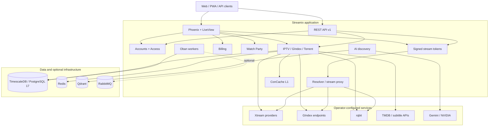
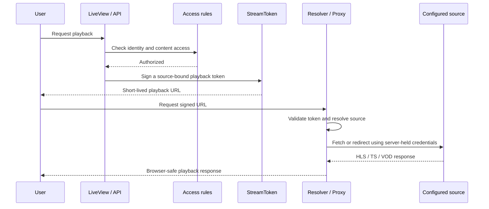

<h1 align="center">
  <br>
  
  <br>
  Streamix
  <br>
</h1>

<p align="center">
  <strong>A self-hosted media aggregation application built with Phoenix + LiveView for organizing external catalogs, protected playback, personal libraries, and shared viewing in one web experience.</strong>
</p>

<p align="center">
  <a href="README.pt.md">Português</a>
</p>

<p align="center">
  
  
  
  
  
  
  
  
  
  
</p>

<p align="center">
  <a href="#highlights">Highlights</a>&nbsp;&nbsp;&nbsp;|&nbsp;&nbsp;&nbsp;
  <a href="#architecture">Architecture</a>&nbsp;&nbsp;&nbsp;|&nbsp;&nbsp;&nbsp;
  <a href="#runtime-surfaces">Runtime Surfaces</a>&nbsp;&nbsp;&nbsp;|&nbsp;&nbsp;&nbsp;
  <a href="#stack">Stack</a>&nbsp;&nbsp;&nbsp;|&nbsp;&nbsp;&nbsp;
  <a href="#quick-start">Quick Start</a>&nbsp;&nbsp;&nbsp;|&nbsp;&nbsp;&nbsp;
  <a href="#project-notes">Project Notes</a>
</p>

<br>

> [!NOTE]
> This repository contains the Phoenix backend, LiveView web application, and REST API. TV clients are maintained
> separately and consume the API exposed here.

> [!IMPORTANT]
> Streamix does not ship channels, movies, subscriptions, provider credentials, or third-party API keys. It organizes
> sources configured by the operator or user. You are responsible for having permission to access and redistribute
> any configured content.

<a id="highlights"></a>

## :sparkles: Highlights

### What Streamix Is

Streamix is a self-hosted aggregation layer for external media sources. It normalizes provider data into a relational
catalog, serves it through a responsive LiveView interface and API, and keeps upstream credentials behind signed,
server-validated playback URLs.

A fresh installation is intentionally empty: the application and local infrastructure will start, but catalog content
only appears after an authorized Xtream, GIndex, or torrent source is configured and synchronized.

### Catalog and Playback

- **Personal Xtream Codes providers** plus an optional system-wide provider
- **Optional GIndex ingestion** for Google Drive-backed movie, series, and anime libraries
- **Optional torrent catalog and playback** through an operator-managed rqbit sidecar
- **Live channels, movies, series, seasons, episodes, and anime**
- **EPG now/next data**, favorites, history, and resumable watch progress
- **Optional TMDB enrichment** and external subtitle lookup
- **Signed stream tokens** and server-side source resolution that keep provider credentials out of browser payloads
- **HLS, transport stream, and VOD playback paths**, with actual codec support depending on the source and browser

### Accounts and Shared Experience

- **Password authentication** with role- and permission-based access
- **Public catalog entry surface** with authenticated browsing and playback
- **Plans, subscriptions, and access entitlements**, with Stripe checkout enabled only when configured
- **Watch parties** with synchronized playback, presence, and room chat
- **Responsive dark-first UI** with an optional light theme
- **Installable PWA** with an offline application shell and metadata caching — not offline video downloads

### Operations and Optional Intelligence

- **Oban-backed synchronization and maintenance jobs**
- **Optional RabbitMQ + Broadway path** for distributed queue processing
- **ConCache L1 + Redis L2 caching**
- **Provider health sampling, circuit breaking, and bounded HTTP pools**
- **Liveness, readiness, Prometheus metrics, and playback diagnostics**
- **Optional semantic search and recommendations** through Gemini or NVIDIA embeddings plus Qdrant

### Scope at a Glance

| Area                  | Current contract                                                                           |
|-----------------------|--------------------------------------------------------------------------------------------|
| Core runtime          | TimescaleDB/PostgreSQL and Redis                                                           |
| Included local stack  | PostgreSQL, Redis, RabbitMQ, Qdrant, and rqbit through Docker Compose                      |
| Optional integrations | GIndex, torrent sources, TMDB, subtitles, Stripe, embeddings, Qdrant, RabbitMQ             |
| Content               | Never bundled; every source and credential is operator- or user-supplied                   |
| Web experience        | Public catalog entry, authenticated library, player, settings, billing, and admin surfaces |
| External clients      | REST API for mobile/TV clients; those client applications live in separate repositories    |

## :fire: More Than a Provider Listing

Many IPTV interfaces render an upstream response directly. Streamix instead persists a normalized catalog and places
accounts, permissions, favorites, progress, billing rules, background synchronization, and playback delivery around
that data.

That makes the application useful as a long-running service, but it also means external systems remain real operational
dependencies. Provider availability, rate limits, redirect behavior, source quality, and browser codec support can all
affect the final playback experience.

<a id="architecture"></a>

## :art: Architecture

### High-Level View


```mermaid
graph TD
    CLIENTS[Web / PWA / API clients]

    subgraph APP["Streamix application"]
        WEB[Phoenix + LiveView]
        API[REST API v1]
        AUTH[Accounts + Access]
        CATALOG[IPTV / GIndex / Torrent]
        BILL[Billing]
        PARTY[Watch Party]
        AI[AI discovery]
        TOKEN[Signed stream tokens]
        DELIVERY[Resolver / stream proxy]
        JOBS[Oban workers]
        L1[ConCache L1]
    end

    subgraph DATA["Data and optional infrastructure"]
        DB[(TimescaleDB / PostgreSQL 17)]
        REDIS[(Redis)]
        QDRANT[(Qdrant)]
        RMQ[(RabbitMQ)]
    end

    subgraph SOURCES["Operator-configured services"]
        XT[Xtream providers]
        GIDX[GIndex endpoints]
        RQBIT[rqbit]
        TMDB[TMDB / subtitle APIs]
        EMB[Gemini / NVIDIA]
    end

    CLIENTS --> WEB
    CLIENTS --> API
    WEB --> AUTH
    WEB --> CATALOG
    WEB --> BILL
    WEB --> PARTY
    API --> AUTH
    API --> CATALOG
    CATALOG --> DB
    CATALOG --> L1
    CATALOG --> REDIS
    CATALOG --> XT
    CATALOG --> GIDX
    CATALOG --> RQBIT
    CATALOG --> TMDB
    WEB --> TOKEN
    API --> TOKEN
    TOKEN --> DELIVERY
    DELIVERY --> XT
    DELIVERY --> GIDX
    DELIVERY --> RQBIT
    AI --> EMB
    AI --> QDRANT
    JOBS --> DB
    JOBS -. optional .-> RMQ
```

### Protected Playback Flow


```mermaid
sequenceDiagram
    participant User
    participant UI as LiveView / API
    participant Access as Access rules
    participant Token as StreamToken
    participant Gateway as Resolver / Proxy
    participant Source as Configured source

    User->>UI: Request playback
    UI->>Access: Check identity and content access
    Access-->>UI: Authorized
    UI->>Token: Sign a source-bound playback token
    Token-->>User: Short-lived playback URL
    User->>Gateway: Request signed URL
    Gateway->>Gateway: Validate token and resolve source
    Gateway->>Source: Fetch or redirect using server-held credentials
    Source-->>Gateway: HLS / TS / VOD response
    Gateway-->>User: Browser-safe playback response
```

<details>
<summary><strong>Core modules worth knowing</strong></summary>

| Area                         | Public entry points                                       |
|------------------------------|-----------------------------------------------------------|
| Accounts and authorization   | `Streamix.Accounts`, `Streamix.Access`                    |
| Xtream catalog and delivery  | `Streamix.Iptv`                                           |
| GIndex catalog               | `Streamix.Gindex`                                         |
| Torrent catalog and playback | `Streamix.Torrent`                                        |
| Billing and entitlements     | `Streamix.Billing`                                        |
| Search and recommendations   | `Streamix.AI`                                             |
| Realtime rooms               | `Streamix.WatchParty`                                     |
| Signed playback              | `StreamixWeb.StreamToken`, `StreamixWeb.StreamController` |
| Background work              | `Streamix.Workers.*`, `Oban`                              |

</details>

<a id="runtime-surfaces"></a>

## :rocket: Runtime Surfaces

### Browser

- Public: `/`, `/plans`, `/tv`, `/login`, `/register`
- Catalog: `/browse`, `/browse/movies`, `/browse/series`, `/browse/animes`, `/search`, `/torrent`
- Personal providers: `/providers`, `/providers/:provider_id/...`
- Library: `/favorites`, `/history`
- GIndex: `/gindex/...`
- Shared viewing: `/party`, `/party/:invite_code`, `/party/:invite_code/watch`
- Playback: `/watch/:type/:id`
- Account and access: `/settings`, `/billing`
- Administration: `/admin`, `/admin/plans`, `/admin/billing`, `/admin/users`

### REST API

The main integration surface lives under `/api/v1`. Production clients should send a configured `X-API-Key`; user
resources additionally validate the relevant user token in their controllers.

At runtime, the provider-aware catalog contract is available as OpenAPI JSON at `/api/v1/openapi.json` and through the
interactive UI at `/api/v1/docs`. Catalog successes consistently return `data` plus optional `meta`; errors return
stable `error.code` and `error.message` fields. See [`docs/api-v1.md`](docs/api-v1.md) for filters, pagination, examples,
and the current breaking-change note.

- `auth` — register, login, logout, and current user
- `catalog` — provider discovery; aggregated and filterable movies, series, channels, and categories; home, search,
  details, and signed stream URLs
- `search` — semantic search, similarity, and capability status
- `recommendations` — personalized items, channels, insights, and profile refresh
- `favorites`, `history`, `epg`, and `telemetry/playback`
- `providers` — personal provider management and synchronization

### Operations

- `GET /api/health` — shallow process liveness
- `GET /api/health/ready` — database, Redis, providers, semantic search, and torrent readiness
- `GET /metrics` — Prometheus metrics protected by operator credentials

<a id="stack"></a>

## :computer: Stack

### Backend

| Technology       | Declared version    | Role                                      |
|------------------|---------------------|-------------------------------------------|
| Elixir           | `~> 1.20`           | Application runtime                       |
| Erlang/OTP       | 29 in CI            | Supervision and concurrency               |
| Phoenix          | `~> 1.8.2`          | HTTP, routing, and application shell      |
| Phoenix LiveView | `~> 1.2`            | Server-rendered interactive UI            |
| Ecto SQL         | `~> 3.13`           | Relational persistence                    |
| Req + Finch      | repository lockfile | HTTP clients and bounded connection pools |
| Oban             | `~> 2.18`           | Database-backed background jobs           |

### Data and Integrations

| Technology                  | Requirement | Role                                                   |
|-----------------------------|-------------|--------------------------------------------------------|
| TimescaleDB / PostgreSQL 17 | required    | Primary relational store, events, and operational data |
| Redis 8                     | required    | Shared cache and hot-path coordination                 |
| Qdrant                      | optional    | Vector search and recommendation data                  |
| RabbitMQ 4                  | optional    | Broadway-based queue processing                        |
| rqbit                       | optional    | Torrent session and byte delivery engine               |
| Stripe                      | optional    | Self-service checkout and billing webhooks             |

### Frontend

| Technology                    | Role                                                                 |
|-------------------------------|----------------------------------------------------------------------|
| Tailwind CSS v4               | Design system and responsive styling                                 |
| esbuild                       | JavaScript bundling and code splitting                               |
| npm packages in `assets/`     | Player engines and browser runtime dependencies                      |
| PWA manifest + service worker | Installability, update lifecycle, and offline shell/metadata caching |
| Playwright                    | Chromium, Firefox, WebKit, mobile, and PWA regression coverage       |

<a id="quick-start"></a>

## :package: Quick Start

### Prerequisites

- Docker with Compose
- Elixir 1.20 and Erlang/OTP 29
- Node.js 26 and npm 12

The repository includes [`.tool-versions`](.tool-versions) for runtime managers such as `mise`.

### 1. Start the local infrastructure

```bash
docker compose up -d
```

The default Compose stack starts PostgreSQL, Redis, RabbitMQ, Qdrant, and rqbit. RabbitMQ, Qdrant-backed discovery, and
torrent ingestion remain application-level opt-ins even when their local containers are running.

### 2. Configure the application

```bash
cp .env.example .env
```

Set at least:

- `ADMIN_PASSWORD` — password for the seeded administrator
- `PROVIDER_ENCRYPTION_KEY` — encrypts stored provider credentials

The example file already points `DATABASE_URL` and `REDIS_URL` at the local Compose services.

### 3. Install browser dependencies

```bash
cd assets && npm ci && cd ..
```

### 4. Create and build the application

```bash
mix setup
```

This installs Mix dependencies, creates and migrates the database, runs seeds, installs asset tooling, and builds the
frontend.

### 5. Start Streamix

```bash
mix phx.server
```

Open [http://localhost:4000](http://localhost:4000), sign in with the configured admin account, and add an authorized
provider or enable one of the system catalog sources.

<details>
<summary><strong>Integration profiles</strong></summary>

| Goal                   | Main variables                                                                                           |
|------------------------|----------------------------------------------------------------------------------------------------------|
| Global Xtream catalog  | `GLOBAL_PROVIDER_ENABLED`, `GLOBAL_PROVIDER_URL`, `GLOBAL_PROVIDER_USERNAME`, `GLOBAL_PROVIDER_PASSWORD` |
| GIndex catalog         | `GINDEX_ENABLED`, `GINDEX_ENDPOINTS`, `GINDEX_SYNC_URL`, `GINDEX_STREAM_URL`                             |
| Torrent catalog        | `TORRENT_ENABLED`, `RQBIT_URL`, source endpoint variables                                                |
| Metadata and subtitles | `TMDB_API_TOKEN`, `OPENSUBTITLES_API_KEY`, `SUBDL_API_KEY`                                               |
| Semantic discovery     | `QDRANT_ENABLED`, `QDRANT_URL`, `GEMINI_API_KEY` or `NVIDIA_API_KEY`                                     |
| Billing                | `STRIPE_SECRET_KEY`, `STRIPE_WEBHOOK_SECRET`, Stripe price variables                                     |
| External clients       | `API_KEYS`, `CORS_ORIGINS`                                                                               |
| Production runtime     | `SECRET_KEY_BASE`, `LIVE_VIEW_SIGNING_SALT`, `PHX_HOST`                                                  |

See [`.env.example`](.env.example) for the complete, commented contract.

</details>

## :wrench: Developer Workflow

```bash
# Backend
mix test
mix test path/to/test.exs
mix test --cover
mix quality
mix precommit

# Frontend
npm --prefix assets run lint
npm --prefix assets test
npm --prefix assets run budget:assets

# Browser and PWA
PLAYWRIGHT_BROWSER=chromium bash scripts/test-playwright-docker.sh
PLAYWRIGHT_BROWSER=firefox bash scripts/test-playwright-docker.sh
PLAYWRIGHT_BROWSER=webkit bash scripts/test-playwright-docker.sh
bash scripts/test-pwa-chromium.sh
```

Test commands deliberately ignore the repository `.env`. Without exported overrides they use the local Compose
`streamix_test` database and Redis database 15. Export `TEST_DATABASE_URL` or `TEST_REDIS_URL` for alternate test
infrastructure; remote hosts and non-`*_test` database names still fail closed unless explicitly authorized.

CI runs compilation, Credo, security and dependency audits, coverage floors, Dialyzer, frontend tests, the three
Playwright browser engines, mobile/PWA smoke tests, image scanning, and immutable-image provenance checks.

<a id="project-notes"></a>

## :memo: Project Notes

- Production deployment is digest-based and uses the versioned contract in
  [`deploy/docker-compose.production.yml`](deploy/docker-compose.production.yml). See
  [`docs/deployment.md`](docs/deployment.md).
- The player protects credentials and provides several delivery engines, but it cannot make an unsupported codec,
  malformed source, or unavailable upstream playable.
- PWA offline support covers the application shell and selected metadata; media playback still requires a reachable
  source.
- GIndex and external provider synchronization must respect upstream quotas and token behavior.
- The TV-facing API remains here, while standalone TV applications are intentionally maintained outside this repository.

## :handshake: Contributing, Security, and License

- [CONTRIBUTING.md](CONTRIBUTING.md)
- [SECURITY.md](SECURITY.md)
- [AGENTS.md](AGENTS.md)
- [LICENSE](LICENSE)

<br>

<p align="center">
  
</p>

<p align="center">
  Crafted by <strong>Gabriel Maia</strong><br>
  <a href="mailto:gabrielmaialva33@gmail.com">gabrielmaialva33@gmail.com</a> ·
  <a href="https://github.com/gabrielmaialva33">GitHub</a>
</p>
