<h1 align="center">
  <br>
  
  <br>
  Streamix - Next-Gen Unified IPTV Platform 📺
  <br>
</h1>

<p align="center">
  <strong>A premium, consolidated streaming experience bringing all your IPTV providers into one intelligent, beautiful interface.</strong>
</p>

<p align="center">
  
  
  
  
  
  
  
</p>

<br>

<p align="center">
  <a href="#sparkles-features">Features</a>&nbsp;&nbsp;&nbsp;|&nbsp;&nbsp;&nbsp;
  <a href="#rocket-capabilities">Capabilities</a>&nbsp;&nbsp;&nbsp;|&nbsp;&nbsp;&nbsp;
  <a href="#computer-technologies">Technologies</a>&nbsp;&nbsp;&nbsp;|&nbsp;&nbsp;&nbsp;
  <a href="#package-installation">Installation</a>&nbsp;&nbsp;&nbsp;|&nbsp;&nbsp;&nbsp;
  <a href="#electric_plug-usage">Usage</a>&nbsp;&nbsp;&nbsp;|&nbsp;&nbsp;&nbsp;
  <a href="#memo-license">License</a>
</p>

<br>

## :sparkles: Features

### Unified Content Management 🎬

- **Multi-Provider Aggregation** - Connect unlimited Xtream Codes IPTV providers in one place
- **Intelligent Sync** - Background synchronization of Live TV, Movies, and Series
- **Global & Private Providers** - System-wide providers for all users or personal private subscriptions
- **Smart Categorization** - Automatic organization of content by genre, country, and resolution
- **Unified Search** - Search across all your providers instantly
- **Favorites & History** - Keep track of what you love and resume where you left off
- **🆕 Cross-Provider Playlists** - Create custom playlists mixing content from different sources
- **🆕 Metadata Enrichment** - Automatic fetching of logos, posters, and EPG data
- **🆕 EPG (Electronic Program Guide)** - Live program info with progress bars on channel cards

### Advanced Streaming Engine ⚡

- **Adaptive Stream Proxying** - Smart proxy system to bypass geo-blocks and insecure content (HLS/MPEG-TS)
- **Low-Latency Playback** - Optimized buffer settings for instant channel zapping
- **Format Intelligence** - Automatic detection and handling of m3u8 and ts stream formats
- **Bandwidth Optimization** - Smart transcoding and stream relay capability
- **Error Recovery** - Automatic reconnection strategies for unstable streams
- **🆕 Multi-Format Support** - Seamless playback of Live Streams, VOD Movies, and Series Episodes
- **🆕 Player API** - Dedicated API endpoints for external player integration

### Premium User Experience 💎

- **Cinematic UI** - Dark-mode first, glassmorphism-inspired design
- **Responsive Layouts** - Perfectly optimized for Desktop, Tablet, and Mobile
- **Instant Navigation** - Powered by Phoenix LiveView for app-like speed without page loads
- **Visual Feedback** - Micro-interactions and smooth transitions
- **Player Controls** - Full suite of controls including quality selection, audio tracks, and subtitles

<br>

## :rocket: Capabilities

### IPTV Protocol Support 📡

```bash
# Supported Standards:
✅ Xtream Codes API - Full integration with standard IPTV panels
✅ M3U Playlists - Advanced parsing and categorization
✅ EPG (XMLTV) - Electronic Program Guide synchronization
✅ HLS (HTTP Live Streaming) - Native .m3u8 playback
✅ MPEG-TS - Transport stream support via proxy
✅ VOD Metadata - Movie and Series information fetching
```

### Content Intelligence

```bash
# Smart Features:
- Automatic provider health checks
- Stream availability monitoring
- Duplicate channel detection
- Intelligent grouped search
- Resource usage optimization (lazy loading)
- Secure credential management (Redacted in DB)
```


<br>

## :art: System Architecture

### High-Level Overview 🏗️

```mermaid
graph TD
    User[👤 User / Client]
    
    subgraph "Streamix Platform"
        LB[🌐 Phoenix Endpoint]
        LV[⚡ LiveView UI]
        API[🔌 REST API]
        Proxy[🔄 Stream Proxy]
        Sync[⚙️ Sync Engine]
    end
    
    subgraph "Data Layer"
        DB[(🐘 PostgreSQL)]
        Cache[(⚡ Cache / ETS)]
    end
    
    subgraph "External World"
        P1[📡 IPTV Provider A]
        P2[📡 IPTV Provider B]
        TM[🎬 TMDB / Metadata]
    end

    User -->|HTTPS| LB
    LB --> LV
    LB --> API
    LB --> Proxy
    
    LV --> DB
    LV <--> Cache
    
    Sync -->|Cron Jobs| P1
    Sync -->|Cron Jobs| P2
    Sync -->|Enrichment| TM
    Sync --> DB
    
    Proxy -->|HLS/TS| P1
```



### Streaming Pipeline 🌊

```mermaid
sequenceDiagram
    participant C as 👤 Client
    participant S as 🛡️ Streamix Core
    participant P as 🔄 Stream Proxy
    participant X as 📡 IPTV Service

    C->>S: Request Stream (Channel 101)
    S->>S: Check User Access & Settings
    
    alt Direct Mode
        S-->>C: Redirect to Provider URL (302)
        C->>X: Play Stream Direct
    else Proxy Mode (Secure/Fix)
        S->>P: Initialize Proxy Session
        P->>X: Open Connection
        X-->>P: Stream Data (MPEG-TS/HLS)
        P-->>P: Buffer & Transcode (Optional)
        P-->>C: Stream Chunks
    end
```


<br>

## :computer: Technologies

### Core Framework

- **[Elixir](https://elixir-lang.org/)** 1.15+ - The backbone of our concurrent architecture
- **[Phoenix Framework](https://www.phoenixframework.org/)** 1.8.2+ - High-performance web interface
- **[Phoenix LiveView](https://hexdocs.pm/phoenix_live_view/)** 1.1.0+ - Real-time smooth UX
- **[OTP](https://www.erlang.org/doc/design_principles/des_princ.html)** - Fault tolerance and supervision

### Data & Connectivity

- **[PostgreSQL](https://www.postgresql.org/)** 14+ - Robust relational data storage
- **[Ecto](https://hexdocs.pm/ecto/)** 3.13+ - Database interaction and query composition
- **[Req](https://hexdocs.pm/req/)** 0.5+ - Powerful HTTP client for provider communication
- **[Bandit](https://hexdocs.pm/bandit/)** - Next-gen HTTP server for Elixir

### Frontend & Design

- **[Tailwind CSS](https://tailwindcss.com/)** v3 - Utility-first styling for custom designs
- **[Heroicons](https://heroicons.com/)** - Beautiful SVG icons
- **[JS Hooks](https://hexdocs.pm/phoenix_live_view/js-interop.html)** - integration for video players and advanced interactions

### Quality & Tools

- **[Credo](https://hexdocs.pm/credo/)** - Code consistency and quality
- **[ExUnit](https://hexdocs.pm/ex_unit/)** - Comprehensive testing framework
- **[Oban](https://getoban.pro/)** - Robust background job processing

<br>

## :package: Installation

### Prerequisites

- **[Elixir](https://elixir-lang.org/install.html)** 1.15+
- **[PostgreSQL](https://www.postgresql.org/download/)** 14+
- **[Node.js](https://nodejs.org/)** (for asset building)

### Quick Start

1. **Clone the repository**

```bash
git clone https://github.com/gabrielmaialva33/streamix.git
cd streamix
```

2. **Install dependencies**

```bash
mix deps.get
```

3. **Setup database**

```bash
mix ecto.setup
```

4. **Start the Phoenix server**

```bash
mix phx.server
```

5. **Access the Application**

Open [http://localhost:4000](http://localhost:4000) in your browser.

<br>

## :electric_plug: Usage

### Provider Management

1. Navigate to **Providers** in the main menu.
2. Click **Add Provider**.
3. Enter your Xtream Codes credentials (URL, Username, Password).
4. Watch as Streamix automatically syncs your channels and VOD library.

### Watching Content

- **Live TV**: Browse by category, search for channels, and click to play instantly.
- **Movies & Series**: Explore your VOD library with rich metadata and one-click playback.
- **Favorites**: Star your top channels for quick access on the dashboard.

<br>

## :memo: License

This project is under the **MIT** license. See [LICENSE](./LICENSE) for details.

<br>

## :handshake: Contributing

Contributions are welcome! Please feel free to submit a Pull Request.

1. Fork the project
2. Create your feature branch (`git checkout -b feature/AmazingFeature`)
3. Commit your changes (`git commit -m 'Add amazing feature'`)
4. Push to the branch (`git push origin feature/AmazingFeature`)
5. Open a Pull Request

<br>

## :busts_in_silhouette: Author

<p align="center">
  
</p>

Made with ❤️ by **Maia**

- 📧 Email: [gabrielmaialva33@gmail.com](mailto:gabrielmaialva33@gmail.com)
- 🐙 GitHub: [@gabrielmaialva33](https://github.com/gabrielmaialva33)

<br>

<p align="center">
  
</p>

<p align="center">
  <strong>Streamix - Where Entertainment Meets Technology.</strong> 📺✨
</p>

<p align="center">
  &copy; 2017-2025 <a href="https://github.com/gabrielmaialva33/" target="_blank">Maia</a>
</p>
