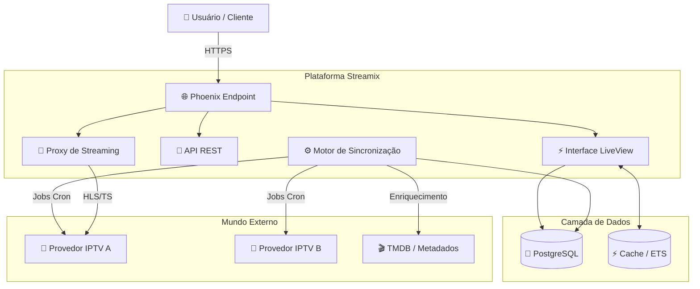
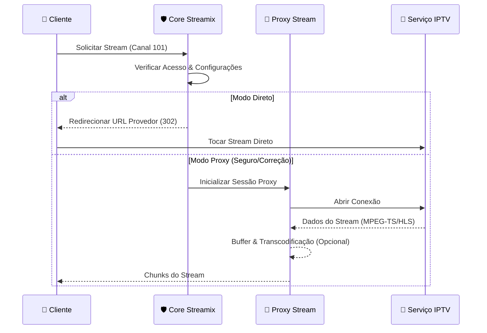

<h1 align="center">
  <br>
  
  <br>
  Streamix - Plataforma IPTV Unificada de Próxima Geração 📺
  <br>
</h1>

<p align="center">
  <strong>Uma experiência de streaming premium e consolidada, reunindo todos os seus provedores IPTV em uma interface inteligente e bela.</strong>
</p>

<p align="center">
  
  
  
  
  
  
  
</p>

<br>

<p align="center">
  <a href="#sparkles-funcionalidades">Funcionalidades</a>&nbsp;&nbsp;&nbsp;|&nbsp;&nbsp;&nbsp;
  <a href="#rocket-capacidades">Capacidades</a>&nbsp;&nbsp;&nbsp;|&nbsp;&nbsp;&nbsp;
  <a href="#computer-tecnologias">Tecnologias</a>&nbsp;&nbsp;&nbsp;|&nbsp;&nbsp;&nbsp;
  <a href="#package-instalação">Instalação</a>&nbsp;&nbsp;&nbsp;|&nbsp;&nbsp;&nbsp;
  <a href="#electric_plug-uso">Uso</a>&nbsp;&nbsp;&nbsp;|&nbsp;&nbsp;&nbsp;
  <a href="#memo-licença">Licença</a>
</p>

<br>

## :sparkles: Funcionalidades

### Gestão Unificada de Conteúdo 🎬

- **Agregação Multi-Provedor** - Conecte provedores IPTV Xtream Codes ilimitados em um só lugar
- **Sincronização Inteligente** - Sincronização em segundo plano de TV Ao Vivo, Filmes e Séries
- **Provedores Globais e Privados** - Provedores do sistema para todos os usuários ou assinaturas pessoais
- **Categorização Inteligente** - Organização automática de conteúdo por gênero, país e resolução
- **Busca Unificada** - Pesquise em todos os seus provedores instantaneamente
- **Favoritos e Histórico** - Acompanhe o que você ama e continue de onde parou
- **🆕 Playlists Cruzadas** - Crie playlists personalizadas misturando conteúdo de diferentes fontes
- **🆕 Enriquecimento de Metadados** - Obtenção automática de logotipos, pôsteres e dados EPG

### Motor de Streaming Avançado ⚡

- **Proxy de Stream Adaptativo** - Sistema de proxy inteligente para contornar bloqueios geográficos e conteúdo inseguro (HLS/MPEG-TS)
- **Reprodução de Baixa Latência** - Configurações de buffer otimizadas para "zapping" instantâneo de canais
- **Inteligência de Formato** - Detecção e tratamento automático de formatos de stream m3u8 e ts
- **Otimização de Largura de Banda** - Transcodificação inteligente e capacidade de retransmissão
- **Recuperação de Erros** - Estratégias de reconexão automática para streams instáveis
- **🆕 Suporte Multi-Formato** - Reprodução perfeita de Canais Ao Vivo, Filmes VOD e Episódios de Séries
- **🆕 API de Player** - Endpoints de API dedicados para integração de players externos

### Experiência de Usuário Premium 💎

- **UI Cinematográfica** - Design focado em Dark Mode, inspirado em glassmorphism
- **Layouts Responsivos** - Perfeitamente otimizado para Desktop, Tablet e Mobile
- **Navegação Instantânea** - Alimentado por Phoenix LiveView para velocidade de app nativo sem recargas
- **Feedback Visual** - Micro-interações e transições suaves
- **Controles do Player** - Conjunto completo de controles, incluindo seleção de qualidade, faixas de áudio e legendas

<br>

## :rocket: Capacidades

### Suporte a Protocolos IPTV 📡

```bash
# Padrões Suportados:
✅ Xtream Codes API - Integração total com painéis IPTV padrão
✅ Listas M3U - Análise e categorização avançadas
✅ EPG (XMLTV) - Sincronização do Guia Eletrônico de Programação
✅ HLS (HTTP Live Streaming) - Reprodução nativa de .m3u8
✅ MPEG-TS - Suporte a stream de transporte via proxy
✅ Metadados VOD - Obtenção de informações de Filmes e Séries
```

### Inteligência de Conteúdo

```bash
# Recursos Inteligentes:
- Verificação automática de saúde do provedor
- Monitoramento de disponibilidade de stream
- Detecção de canais duplicados
- Busca agrupada inteligente
- Otimização de uso de recursos (lazy loading)
- Gestão segura de credenciais (Redacted no DB)
```


<br>

## :art: Arquitetura do Sistema

### Visão Geral 🏗️



### Pipeline de Streaming 🌊


<br>

## :computer: Tecnologias

### Framework Core

- **[Elixir](https://elixir-lang.org/)** 1.15+ - A espinha dorsal da nossa arquitetura concorrente
- **[Phoenix Framework](https://www.phoenixframework.org/)** 1.8.2+ - Interface web de alta performance
- **[Phoenix LiveView](https://hexdocs.pm/phoenix_live_view/)** 1.1.0+ - UX em tempo real fluido
- **[OTP](https://www.erlang.org/doc/design_principles/des_princ.html)** - Tolerância a falhas e supervisão

### Dados e Conectividade

- **[PostgreSQL](https://www.postgresql.org/)** 14+ - Armazenamento de dados relacional robusto
- **[Ecto](https://hexdocs.pm/ecto/)** 3.13+ - Interação com banco de dados e composição de queries
- **[Req](https://hexdocs.pm/req/)** 0.5+ - Cliente HTTP poderoso para comunicação com provedores
- **[Bandit](https://hexdocs.pm/bandit/)** - Servidor HTTP de próxima geração para Elixir

### Frontend e Design

- **[Tailwind CSS](https://tailwindcss.com/)** v3 - Estilização utility-first para designs personalizados
- **[Heroicons](https://heroicons.com/)** - Ícones SVG belíssimos
- **[JS Hooks](https://hexdocs.pm/phoenix_live_view/js-interop.html)** - Integração para players de vídeo e interações avançadas

### Qualidade e Ferramentas

- **[Credo](https://hexdocs.pm/credo/)** - Consistência e qualidade de código
- **[ExUnit](https://hexdocs.pm/ex_unit/)** - Framework de testes abrangente
- **[Oban](https://getoban.pro/)** - Processamento robusto de jobs em segundo plano

<br>

## :package: Instalação

### Pré-requisitos

- **[Elixir](https://elixir-lang.org/install.html)** 1.15+
- **[PostgreSQL](https://www.postgresql.org/download/)** 14+
- **[Node.js](https://nodejs.org/)** (para build de assets)

### Início Rápido

1. **Clone o repositório**

```bash
git clone https://github.com/gabrielmaialva33/streamix.git
cd streamix
```

2. **Instale as dependências**

```bash
mix deps.get
```

3. **Configure o banco de dados**

```bash
mix ecto.setup
```

4. **Inicie o servidor Phoenix**

```bash
mix phx.server
```

5. **Acesse a Aplicação**

Abra [http://localhost:4000](http://localhost:4000) no seu navegador.

<br>

## :electric_plug: Uso

### Gestão de Provedores

1. Navegue até **Provedores** no menu principal.
2. Clique em **Adicionar Provedor**.
3. Insira suas credenciais Xtream Codes (URL, Usuário, Senha).
4. Observe enquanto o Streamix sincroniza automaticamente seus canais e biblioteca VOD.

### Assistindo Conteúdo

- **TV Ao Vivo**: Navegue por categoria, pesquise canais e clique para assistir instantaneamente.
- **Filmes e Séries**: Explore sua biblioteca VOD com metadados ricos e reprodução em um clique.
- **Favoritos**: Marque seus canais principais para acesso rápido no painel.

<br>

## :memo: Licença

Este projeto está sob a licença **MIT**. Veja [LICENSE](./LICENSE) para detalhes.

<br>

## :handshake: Contribuindo

Contribuições são bem-vindas! Sinta-se à vontade para enviar um Pull Request.

1. Faça um Fork do projeto
2. Crie sua branch de feature (`git checkout -b feature/RecursoIncrivel`)
3. Commit suas mudanças (`git commit -m 'Adiciona recurso incrível'`)
4. Push para a branch (`git push origin feature/RecursoIncrivel`)
5. Abra um Pull Request

<br>

## :busts_in_silhouette: Autor

<p align="center">
  
</p>

Feito com ❤️ por **Maia**

- 📧 Email: [gabrielmaialva33@gmail.com](mailto:gabrielmaialva33@gmail.com)
- 🐙 GitHub: [@gabrielmaialva33](https://github.com/gabrielmaialva33)

<br>

<p align="center">
  
</p>

<p align="center">
  <strong>Streamix - Onde o Entretenimento Encontra a Tecnologia.</strong> 📺✨
</p>

<p align="center">
  &copy; 2017-presente <a href="https://github.com/gabrielmaialva33/" target="_blank">Maia</a>
</p>
