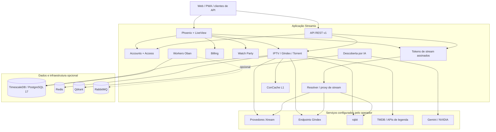
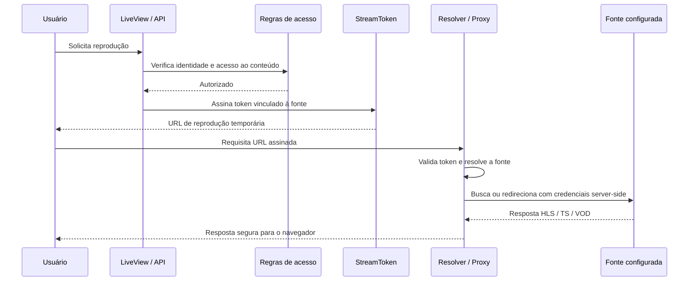

<h1 align="center">
  <br>
  
  <br>
  Streamix
  <br>
</h1>

<p align="center">
  <strong>Uma aplicação auto-hospedada de agregação de mídia, construída com Phoenix + LiveView para reunir catálogos externos, reprodução protegida, biblioteca pessoal e sessões compartilhadas numa única experiência web.</strong>
</p>

<p align="center">
  <a href="README.md">English</a>
</p>

<p align="center">
  
  
  
  
  
  
  
  
  
  
</p>

<p align="center">
  <a href="#destaques">Destaques</a>&nbsp;&nbsp;&nbsp;|&nbsp;&nbsp;&nbsp;
  <a href="#arquitetura">Arquitetura</a>&nbsp;&nbsp;&nbsp;|&nbsp;&nbsp;&nbsp;
  <a href="#superficies">Superfícies</a>&nbsp;&nbsp;&nbsp;|&nbsp;&nbsp;&nbsp;
  <a href="#stack">Stack</a>&nbsp;&nbsp;&nbsp;|&nbsp;&nbsp;&nbsp;
  <a href="#inicio-rapido">Início Rápido</a>&nbsp;&nbsp;&nbsp;|&nbsp;&nbsp;&nbsp;
  <a href="#notas-do-projeto">Notas do Projeto</a>
</p>

<br>

> [!NOTE]
> Este repositório contém o backend Phoenix, a aplicação web em LiveView e a API REST. Os clientes de TV são mantidos
> separadamente e consomem a API exposta aqui.

> [!IMPORTANT]
> O Streamix não fornece canais, filmes, assinaturas, credenciais de provedores nem chaves de APIs externas. Ele organiza
> as fontes configuradas pelo operador ou usuário. Você é responsável por ter autorização para acessar e disponibilizar
> qualquer conteúdo configurado.

<a id="destaques"></a>

## :sparkles: Destaques

### O Que É o Streamix

O Streamix é uma camada auto-hospedada de agregação para fontes externas de mídia. Ele normaliza os dados dos provedores
num catálogo relacional, entrega esse catálogo por uma interface LiveView responsiva e por API, e mantém as credenciais
upstream protegidas por URLs de reprodução assinadas e validadas no servidor.

Uma instalação nova fica vazia de propósito: a aplicação e a infraestrutura local sobem normalmente, mas o conteúdo só
aparece depois que uma fonte autorizada de Xtream, GIndex ou torrent é configurada e sincronizada.

### Catálogo e Reprodução

- **Provedores pessoais Xtream Codes** e um provedor global opcional
- **Ingestão opcional via GIndex** para bibliotecas de filmes, séries e animes em Google Drive
- **Catálogo e reprodução opcional por torrent** usando um sidecar rqbit administrado pelo operador
- **Canais ao vivo, filmes, séries, temporadas, episódios e animes**
- **EPG com programação atual/próxima**, favoritos, histórico e retomada do progresso
- **Enriquecimento opcional pelo TMDB** e busca externa de legendas
- **Tokens de stream assinados** e resolução server-side que mantêm credenciais fora dos payloads do navegador
- **Caminhos de reprodução HLS, transport stream e VOD**, com suporte real de codecs dependente da fonte e do navegador

### Contas e Experiência Compartilhada

- **Autenticação por senha** com acesso baseado em papéis e permissões
- **Entrada pública pelo catálogo**, com navegação completa e reprodução autenticadas
- **Planos, assinaturas e regras de acesso**, com checkout Stripe ativado somente quando configurado
- **Watch parties** com reprodução sincronizada, presença e chat da sala
- **UI responsiva dark-first** com tema claro opcional
- **PWA instalável** com shell offline e cache de metadados — não download offline de vídeos

### Operação e Inteligência Opcional

- **Sincronizações e manutenções em background com Oban**
- **Caminho opcional RabbitMQ + Broadway** para processamento distribuído de filas
- **Cache ConCache L1 + Redis L2**
- **Amostragem de saúde dos provedores, circuit breaker e pools HTTP limitados**
- **Liveness, readiness, métricas Prometheus e diagnósticos de reprodução**
- **Busca semântica e recomendações opcionais** via embeddings Gemini ou NVIDIA com Qdrant

### Escopo em Poucas Linhas

| Área | Contrato atual |
|------|----------------|
| Runtime principal | TimescaleDB/PostgreSQL e Redis |
| Stack local incluída | PostgreSQL, Redis, RabbitMQ, Qdrant e rqbit via Docker Compose |
| Integrações opcionais | GIndex, fontes torrent, TMDB, legendas, Stripe, embeddings, Qdrant e RabbitMQ |
| Conteúdo | Nunca vem embutido; toda fonte e credencial é fornecida pelo operador ou usuário |
| Experiência web | Entrada pública, biblioteca autenticada, player, configurações, billing e administração |
| Clientes externos | API REST para mobile/TV; essas aplicações vivem em repositórios separados |

## :fire: Mais do Que uma Lista de Provedor

Muitas interfaces IPTV apenas renderizam a resposta do upstream. O Streamix persiste um catálogo normalizado e organiza
contas, permissões, favoritos, progresso, regras de cobrança, sincronização em background e entrega de mídia ao redor
desses dados.

Isso torna a aplicação adequada para rodar como serviço contínuo, mas também mantém as dependências externas bem reais.
Disponibilidade do provedor, rate limits, comportamento de redirects, qualidade da fonte e suporte de codecs no navegador
podem afetar a experiência final de reprodução.

<a id="arquitetura"></a>

## :art: Arquitetura

### Visão Geral


```mermaid
graph TD
    CLIENTS[Web / PWA / clientes de API]

    subgraph APP["Aplicação Streamix"]
        WEB[Phoenix + LiveView]
        API[API REST v1]
        AUTH[Accounts + Access]
        CATALOG[IPTV / GIndex / Torrent]
        BILL[Billing]
        PARTY[Watch Party]
        AI[Descoberta por IA]
        TOKEN[Tokens de stream assinados]
        DELIVERY[Resolver / proxy de stream]
        JOBS[Workers Oban]
        L1[ConCache L1]
    end

    subgraph DATA["Dados e infraestrutura opcional"]
        DB[(TimescaleDB / PostgreSQL 17)]
        REDIS[(Redis)]
        QDRANT[(Qdrant)]
        RMQ[(RabbitMQ)]
    end

    subgraph SOURCES["Serviços configurados pelo operador"]
        XT[Provedores Xtream]
        GIDX[Endpoints GIndex]
        RQBIT[rqbit]
        TMDB[TMDB / APIs de legenda]
        EMB[Gemini / NVIDIA]
    end

    CLIENTS --> WEB
    CLIENTS --> API
    WEB --> AUTH
    WEB --> CATALOG
    WEB --> BILL
    WEB --> PARTY
    API --> AUTH
    API --> CATALOG
    CATALOG --> DB
    CATALOG --> L1
    CATALOG --> REDIS
    CATALOG --> XT
    CATALOG --> GIDX
    CATALOG --> RQBIT
    CATALOG --> TMDB
    WEB --> TOKEN
    API --> TOKEN
    TOKEN --> DELIVERY
    DELIVERY --> XT
    DELIVERY --> GIDX
    DELIVERY --> RQBIT
    AI --> EMB
    AI --> QDRANT
    JOBS --> DB
    JOBS -. opcional .-> RMQ
```

### Fluxo de Reprodução Protegida


```mermaid
sequenceDiagram
    participant Usuario as Usuário
    participant UI as LiveView / API
    participant Access as Regras de acesso
    participant Token as StreamToken
    participant Gateway as Resolver / Proxy
    participant Source as Fonte configurada

    Usuario->>UI: Solicita reprodução
    UI->>Access: Verifica identidade e acesso ao conteúdo
    Access-->>UI: Autorizado
    UI->>Token: Assina token vinculado à fonte
    Token-->>Usuario: URL de reprodução temporária
    Usuario->>Gateway: Requisita URL assinada
    Gateway->>Gateway: Valida token e resolve a fonte
    Gateway->>Source: Busca ou redireciona com credenciais server-side
    Source-->>Gateway: Resposta HLS / TS / VOD
    Gateway-->>Usuario: Resposta segura para o navegador
```

<details>
<summary><strong>Módulos centrais que vale conhecer</strong></summary>

| Área | Pontos de entrada públicos |
|------|----------------------------|
| Contas e autorização | `Streamix.Accounts`, `Streamix.Access` |
| Catálogo e entrega Xtream | `Streamix.Iptv` |
| Catálogo GIndex | `Streamix.Gindex` |
| Catálogo e reprodução torrent | `Streamix.Torrent` |
| Billing e regras de acesso | `Streamix.Billing` |
| Busca e recomendações | `Streamix.AI` |
| Salas em tempo real | `Streamix.WatchParty` |
| Reprodução assinada | `StreamixWeb.StreamToken`, `StreamixWeb.StreamController` |
| Trabalho em background | `Streamix.Workers.*`, `Oban` |

</details>

<a id="superficies"></a>

## :rocket: Superfícies em Runtime

### Navegador

- Públicas: `/`, `/plans`, `/tv`, `/login`, `/register`
- Catálogo: `/browse`, `/browse/movies`, `/browse/series`, `/browse/animes`, `/search`, `/torrent`
- Provedores pessoais: `/providers`, `/providers/:provider_id/...`
- Biblioteca: `/favorites`, `/history`
- GIndex: `/gindex/...`
- Sessões compartilhadas: `/party`, `/party/:invite_code`, `/party/:invite_code/watch`
- Reprodução: `/watch/:type/:id`
- Conta e acesso: `/settings`, `/billing`
- Administração: `/admin`, `/admin/plans`, `/admin/billing`, `/admin/users`

### API REST

A principal superfície de integração fica em `/api/v1`. Em produção, os clientes devem enviar um `X-API-Key`
configurado; recursos do usuário também validam o token correspondente em seus controllers.

Em runtime, o contrato do catálogo com suporte a múltiplos provedores fica disponível como OpenAPI JSON em
`/api/v1/openapi.json` e na interface interativa em `/api/v1/docs`. Respostas de sucesso do catálogo usam `data` e, quando
necessário, `meta`; erros mantêm os campos estáveis `error.code` e `error.message`. Consulte
[`docs/api-v1.md`](docs/api-v1.md) para filtros, paginação, exemplos e a nota de quebra de compatibilidade atual.

- `auth` — cadastro, login, logout e usuário atual
- `catalog` — descoberta de provedores; filmes, séries, canais e categorias agregados e filtráveis; home, busca,
  detalhes e URLs de stream assinadas
- `search` — busca semântica, similaridade e status das capacidades
- `recommendations` — itens personalizados, canais, insights e atualização de perfil
- `favorites`, `history`, `epg` e `telemetry/playback`
- `providers` — gestão e sincronização de provedores pessoais

### Operação

- `GET /api/health` — liveness superficial do processo
- `GET /api/health/ready` — readiness de banco, Redis, provedores, busca semântica e torrent
- `GET /metrics` — métricas Prometheus protegidas por credenciais do operador

<a id="stack"></a>

## :computer: Stack

### Backend

| Tecnologia       | Versão declarada        | Papel                                      |
|------------------|-------------------------|--------------------------------------------|
| Elixir           | `~> 1.20`               | Runtime da aplicação                       |
| Erlang/OTP       | 29 na CI                | Supervisão e concorrência                  |
| Phoenix          | `~> 1.8.2`              | HTTP, rotas e shell da aplicação           |
| Phoenix LiveView | `~> 1.2`                | UI interativa renderizada no servidor      |
| Ecto SQL         | `~> 3.13`               | Persistência relacional                    |
| Req + Finch      | lockfile do repositório | Clientes HTTP e pools limitados de conexão |
| Oban             | `~> 2.18`               | Jobs em background apoiados pelo banco     |

### Dados e Integrações

| Tecnologia | Requisito | Papel |
|------------|-----------|-------|
| TimescaleDB / PostgreSQL 17 | obrigatório | Banco relacional, eventos e dados operacionais |
| Redis 7 | obrigatório | Cache compartilhado e coordenação de hot paths |
| Qdrant | opcional | Busca vetorial e dados de recomendação |
| RabbitMQ 4 | opcional | Processamento de filas com Broadway |
| rqbit | opcional | Motor de sessões torrent e entrega de bytes |
| Stripe | opcional | Checkout self-service e webhooks de cobrança |

### Frontend

| Tecnologia                    | Papel                                                               |
|-------------------------------|---------------------------------------------------------------------|
| Tailwind CSS v4               | Design system e estilos responsivos                                 |
| esbuild                       | Bundling e code splitting de JavaScript                             |
| Pacotes npm em `assets/`      | Engines do player e dependências do runtime do navegador            |
| Manifest PWA + service worker | Instalação, ciclo de atualização e cache offline de shell/metadados |
| Playwright                    | Regressão em Chromium, Firefox, WebKit, mobile e PWA                |

<a id="inicio-rapido"></a>

## :package: Início Rápido

### Pré-requisitos

- Docker com Compose
- Elixir 1.20 e Erlang/OTP 29
- Node.js 26 e npm 12

O repositório inclui [`.tool-versions`](.tool-versions) para gerenciadores de runtime como o `mise`.

### 1. Suba a infraestrutura local

```bash
docker compose up -d
```

O Compose padrão inicia PostgreSQL, Redis, RabbitMQ, Qdrant e rqbit. RabbitMQ, descoberta com Qdrant e ingestão torrent
continuam sendo opt-ins da aplicação mesmo quando seus containers locais estão rodando.

### 2. Configure a aplicação

```bash
cp .env.example .env
```

Defina pelo menos:

- `ADMIN_PASSWORD` — senha do administrador criado pelos seeds
- `PROVIDER_ENCRYPTION_KEY` — criptografa as credenciais armazenadas dos provedores

O arquivo de exemplo já aponta `DATABASE_URL` e `REDIS_URL` para os serviços locais do Compose.

### 3. Instale as dependências do navegador

```bash
cd assets && npm ci && cd ..
```

### 4. Crie e compile a aplicação

```bash
mix setup
```

Esse comando instala as dependências Mix, cria e migra o banco, executa os seeds, instala o tooling de assets e compila
o frontend.

### 5. Inicie o Streamix

```bash
mix phx.server
```

Abra [http://localhost:4000](http://localhost:4000), entre com o administrador configurado e adicione um provedor
autorizado ou habilite uma das fontes de catálogo do sistema.

<details>
<summary><strong>Perfis de integração</strong></summary>

| Objetivo               | Variáveis principais                                                                                     |
|------------------------|----------------------------------------------------------------------------------------------------------|
| Catálogo Xtream global | `GLOBAL_PROVIDER_ENABLED`, `GLOBAL_PROVIDER_URL`, `GLOBAL_PROVIDER_USERNAME`, `GLOBAL_PROVIDER_PASSWORD` |
| Catálogo GIndex        | `GINDEX_ENABLED`, `GINDEX_ENDPOINTS`, `GINDEX_SYNC_URL`, `GINDEX_STREAM_URL`                             |
| Catálogo torrent       | `TORRENT_ENABLED`, `RQBIT_URL`, variáveis dos endpoints das fontes                                       |
| Metadados e legendas   | `TMDB_API_TOKEN`, `OPENSUBTITLES_API_KEY`, `SUBDL_API_KEY`                                               |
| Descoberta semântica   | `QDRANT_ENABLED`, `QDRANT_URL`, `GEMINI_API_KEY` ou `NVIDIA_API_KEY`                                     |
| Billing                | `STRIPE_SECRET_KEY`, `STRIPE_WEBHOOK_SECRET`, variáveis de preço do Stripe                               |
| Clientes externos      | `API_KEYS`, `CORS_ORIGINS`                                                                               |
| Runtime de produção    | `SECRET_KEY_BASE`, `LIVE_VIEW_SIGNING_SALT`, `PHX_HOST`                                                  |

Veja o contrato completo e comentado em [`.env.example`](.env.example).

</details>

## :wrench: Fluxo de Desenvolvimento

```bash
# Backend
mix test
mix test path/to/test.exs
mix test --cover
mix quality
mix precommit

# Frontend
npm --prefix assets run lint
npm --prefix assets test
npm --prefix assets run budget:assets

# Navegadores e PWA
PLAYWRIGHT_BROWSER=chromium bash scripts/test-playwright-docker.sh
PLAYWRIGHT_BROWSER=firefox bash scripts/test-playwright-docker.sh
PLAYWRIGHT_BROWSER=webkit bash scripts/test-playwright-docker.sh
bash scripts/test-pwa-chromium.sh
```

Os testes recusam hosts remotos e bancos cujo nome não termina em `*_test`. Configure `TEST_DATABASE_URL`
explicitamente quando o `DATABASE_URL` de desenvolvimento apontar para qualquer lugar além do banco local de testes.

A CI executa compilação, Credo, auditorias de segurança e dependências, pisos de cobertura, Dialyzer, testes de frontend,
os três engines do Playwright, smokes mobile/PWA, scan da imagem e validação de provenance da imagem imutável.

<a id="notas-do-projeto"></a>

## :memo: Notas do Projeto

- O deploy de produção é feito por digest e usa o contrato versionado em
  [`deploy/docker-compose.production.yml`](deploy/docker-compose.production.yml). Veja
  [`docs/deployment.md`](docs/deployment.md).
- O player protege credenciais e oferece diferentes engines de entrega, mas não consegue tornar reproduzível um codec
  incompatível, uma fonte malformada ou um upstream indisponível.
- O suporte offline da PWA cobre o shell da aplicação e metadados selecionados; a reprodução ainda exige uma fonte
  acessível.
- A sincronização de GIndex e provedores externos precisa respeitar quotas e o comportamento dos tokens upstream.
- A API voltada a TV permanece neste repositório, enquanto as aplicações de TV são mantidas separadamente.

## :handshake: Contribuição, Segurança e Licença

- [CONTRIBUTING.md](CONTRIBUTING.md)
- [SECURITY.md](SECURITY.md)
- [AGENTS.md](AGENTS.md)
- [LICENSE](LICENSE)

<br>

<p align="center">
  
</p>

<p align="center">
  Criado por <strong>Gabriel Maia</strong><br>
  <a href="mailto:gabrielmaialva33@gmail.com">gabrielmaialva33@gmail.com</a> ·
  <a href="https://github.com/gabrielmaialva33">GitHub</a>
</p>
