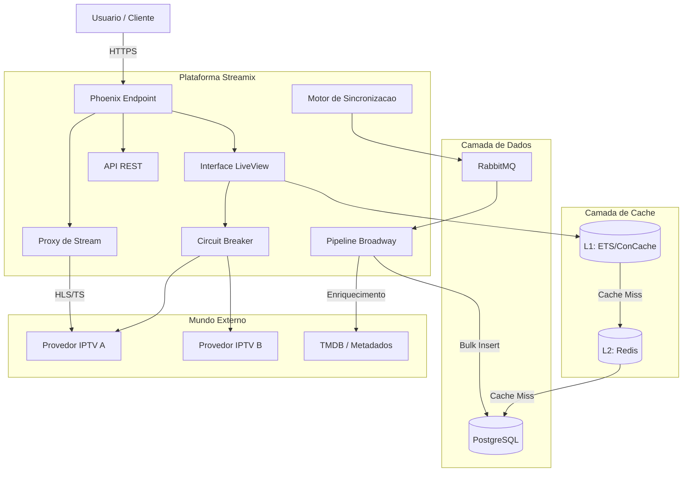
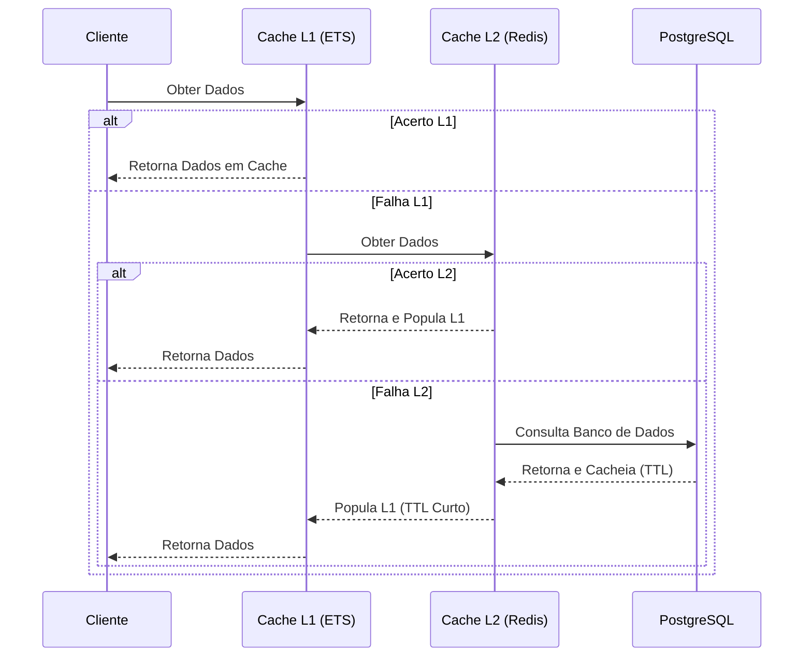
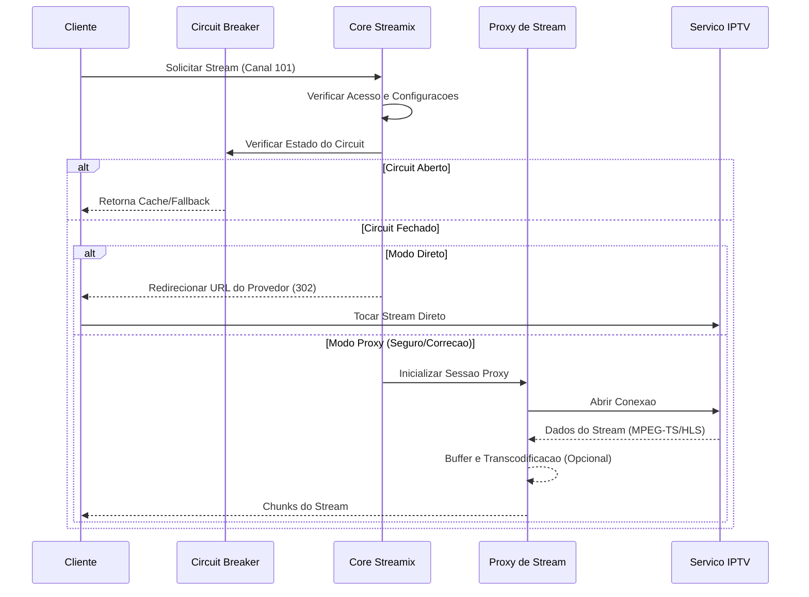

<h1 align="center">
  <br>
  
  <br>
  Streamix - Plataforma IPTV Unificada de Proxima Geracao
  <br>
</h1>

<p align="center">
  <strong>Uma experiencia de streaming premium e consolidada, reunindo todos os seus provedores IPTV em uma interface inteligente e bela.</strong>
</p>

<p align="center">
  <a href="README.md">English</a>
</p>

<p align="center">
  
  
  
  
  
  
  
  
  
</p>

<br>

<p align="center">
  <a href="#sparkles-funcionalidades">Funcionalidades</a>&nbsp;&nbsp;&nbsp;|&nbsp;&nbsp;&nbsp;
  <a href="#rocket-capacidades">Capacidades</a>&nbsp;&nbsp;&nbsp;|&nbsp;&nbsp;&nbsp;
  <a href="#computer-tecnologias">Tecnologias</a>&nbsp;&nbsp;&nbsp;|&nbsp;&nbsp;&nbsp;
  <a href="#package-instalacao">Instalacao</a>&nbsp;&nbsp;&nbsp;|&nbsp;&nbsp;&nbsp;
  <a href="#electric_plug-uso">Uso</a>&nbsp;&nbsp;&nbsp;|&nbsp;&nbsp;&nbsp;
  <a href="#memo-licenca">Licenca</a>
</p>

<br>

## :sparkles: Funcionalidades

### Gestao Unificada de Conteudo

- **Agregacao Multi-Provedor** - Conecte provedores IPTV Xtream Codes ilimitados em um so lugar
- **Sincronizacao Inteligente** - Sincronizacao em segundo plano de TV Ao Vivo, Filmes e Series
- **Provedores Globais e Privados** - Provedores do sistema para todos os usuarios ou assinaturas pessoais
- **Categorizacao Inteligente** - Organizacao automatica de conteudo por genero, pais e resolucao
- **Busca Unificada** - Pesquise em todos os seus provedores instantaneamente com otimizacao pg_trgm
- **Favoritos e Historico** - Acompanhe o que voce ama e continue de onde parou
- **Playlists Cruzadas** - Crie playlists personalizadas misturando conteudo de diferentes fontes
- **Integracao com Cloud Drive** - Transmita filmes e series diretamente do GIndex/Google Drive
- **Enriquecimento de Metadados** - Obtencao automatica de logotipos, posteres e dados EPG
- **EPG (Guia Eletronico de Programacao)** - Informacoes de programas ao vivo com barras de progresso nos cards de
  canais

### Motor de Streaming Avancado

- **Proxy de Stream Adaptativo** - Sistema de proxy inteligente para contornar bloqueios geograficos e conteudo
  inseguro (HLS/MPEG-TS)
- **Reproducao de Baixa Latencia** - Configuracoes de buffer otimizadas para "zapping" instantaneo de canais
- **Inteligencia de Formato** - Deteccao e tratamento automatico de formatos de stream m3u8 e ts
- **Otimizacao de Largura de Banda** - Transcodificacao inteligente e capacidade de retransmissao
- **Recuperacao de Erros** - Estrategias de reconexao automatica para streams instaveis
- **Suporte Multi-Formato** - Reproducao perfeita de Canais Ao Vivo, Filmes VOD e Episodios de Series
- **API de Player** - Endpoints de API dedicados para integracao de players externos
- **Pre-fetch do Proximo Episodio** - Carrega automaticamente o proximo episodio para maratonas sem interrupcao

### Experiencia de Usuario Premium

- **UI Cinematografica** - Design focado em Dark Mode, inspirado em glassmorphism
- **Layouts Responsivos** - Perfeitamente otimizado para Desktop, Tablet e Mobile
- **Navegacao Instantanea** - Alimentado por Phoenix LiveView para velocidade de app nativo sem recargas
- **Feedback Visual** - Micro-interacoes e transicoes suaves
- **Controles do Player** - Conjunto completo de controles, incluindo selecao de qualidade, faixas de audio e legendas

### Processamento Distribuido

- **Broadway + RabbitMQ** - Pipeline de sincronizacao distribuida para sincronizacao de provedores de alto throughput
- **Jobs em Segundo Plano** - Processamento robusto de jobs com Oban para execucao confiavel de tarefas

### Recursos com IA

- **Similaridade Semantica** - Recomendacoes baseadas em IA usando similaridade de conteudo
- **Busca Inteligente** - Busca com trigramas pg_trgm para correspondencia fuzzy e tolerancia a erros de digitacao

### PWA e Suporte Offline

- **Progressive Web App** - Instale o Streamix como um app nativo em qualquer dispositivo
- **Cache IndexedDB** - Armazenamento offline de metadados para navegacao sem conexao
- **Atualizacoes do Service Worker** - Atualizacoes automaticas em segundo plano com notificacao ao usuario

### Seguranca e Resiliencia

- **Circuit Breaker** - Padroes de resiliencia estilo Netflix para chamadas a servicos externos
- **Rate Limiting** - Protecao baseada em Hammer contra abusos
- **CSP Nonces** - Content Security Policy com nonces dinamicos
- **Headers de Seguranca** - Headers HTTP de seguranca abrangentes

<br>

## :rocket: Capacidades

### Suporte a Protocolos IPTV

```bash
# Padroes Suportados:
- Xtream Codes API - Integracao total com paineis IPTV padrao
- Listas M3U - Analise e categorizacao avancadas
- EPG (XMLTV) - Sincronizacao do Guia Eletronico de Programacao
- HLS (HTTP Live Streaming) - Reproducao nativa de .m3u8
- MPEG-TS - Suporte a stream de transporte via proxy
- Metadados VOD - Obtencao de informacoes de Filmes e Series
```

### Integracao em Nuvem

```bash
# Suporte GIndex:
- Indexacao Direta - Streaming direto do Google Drive
- Links Seguros - Geracao de URLs assinadas com cache de expiracao
- Scraping Inteligente - Analise automatica de estrutura de pastas
```

### Inteligencia de Conteudo

```bash
# Recursos Inteligentes:
- Verificacao automatica de saude do provedor
- Monitoramento de disponibilidade de stream
- Deteccao de canais duplicados
- Busca agrupada inteligente
- Otimizacao de uso de recursos (lazy loading)
- Gestao segura de credenciais (Redacted no DB)
```

### Padroes de Resiliencia

```bash
# Tolerancia a Falhas:
- Circuit Breaker - Previne falhas em cascata com estados aberto/semi-aberto/fechado
- Cache Multi-Camada (L1+L2) - ETS (L1) + Redis (L2) para performance otima
- Rate Limiting - Limitacao de requisicoes por usuario e por IP
- Connection Pooling - Pools Finch para conexoes HTTP eficientes
- Degradacao Graciosa - Estrategias de fallback quando servicos estao indisponiveis
```

<br>

## :art: Arquitetura do Sistema

### Visao Geral de Alto Nivel


```mermaid
graph TD
    User[Usuario / Cliente]

    subgraph "Plataforma Streamix"
        LB[Phoenix Endpoint]
        LV[Interface LiveView]
        API[API REST]
        Proxy[Proxy de Stream]
        CB[Circuit Breaker]
        Sync[Motor de Sincronizacao]
        Broadway[Pipeline Broadway]
    end

    subgraph "Camada de Cache"
        L1[(L1: ETS/ConCache)]
        L2[(L2: Redis)]
    end

    subgraph "Camada de Dados"
        DB[(PostgreSQL)]
        RMQ[RabbitMQ]
    end

    subgraph "Mundo Externo"
        P1[Provedor IPTV A]
        P2[Provedor IPTV B]
        TM[TMDB / Metadados]
    end

    User -->|HTTPS| LB
    LB --> LV
    LB --> API
    LB --> Proxy

    LV --> L1
    L1 -->|Cache Miss| L2
    L2 -->|Cache Miss| DB

    LV --> CB
    CB --> P1
    CB --> P2

    Sync --> RMQ
    RMQ --> Broadway
    Broadway -->|Bulk Insert| DB
    Broadway -->|Enriquecimento| TM

    Proxy -->|HLS/TS| P1
```

### Fluxo de Cache (L1 + L2)


```mermaid
sequenceDiagram
    participant C as Cliente
    participant L1 as Cache L1 (ETS)
    participant L2 as Cache L2 (Redis)
    participant DB as PostgreSQL

    C->>L1: Obter Dados
    alt Acerto L1
        L1-->>C: Retorna Dados em Cache
    else Falha L1
        L1->>L2: Obter Dados
        alt Acerto L2
            L2-->>L1: Retorna e Popula L1
            L1-->>C: Retorna Dados
        else Falha L2
            L2->>DB: Consulta Banco de Dados
            DB-->>L2: Retorna e Cacheia (TTL)
            L2-->>L1: Popula L1 (TTL Curto)
            L1-->>C: Retorna Dados
        end
    end
```

### Pipeline de Streaming


```mermaid
sequenceDiagram
    participant C as Cliente
    participant CB as Circuit Breaker
    participant S as Core Streamix
    participant P as Proxy de Stream
    participant X as Servico IPTV

    C->>S: Solicitar Stream (Canal 101)
    S->>S: Verificar Acesso e Configuracoes
    S->>CB: Verificar Estado do Circuit

    alt Circuit Aberto
        CB-->>C: Retorna Cache/Fallback
    else Circuit Fechado
        alt Modo Direto
            S-->>C: Redirecionar URL do Provedor (302)
            C->>X: Tocar Stream Direto
        else Modo Proxy (Seguro/Correcao)
            S->>P: Inicializar Sessao Proxy
            P->>X: Abrir Conexao
            X-->>P: Dados do Stream (MPEG-TS/HLS)
            P-->>P: Buffer e Transcodificacao (Opcional)
            P-->>C: Chunks do Stream
        end
    end
```

<br>

## :computer: Tecnologias

### Framework Core

| Tecnologia                                                         | Versao | Descricao                                         |
|--------------------------------------------------------------------|--------|---------------------------------------------------|
| [Elixir](https://elixir-lang.org/)                                 | 1.15+  | A espinha dorsal da nossa arquitetura concorrente |
| [Phoenix Framework](https://www.phoenixframework.org/)             | 1.8.2+ | Interface web de alta performance                 |
| [Phoenix LiveView](https://hexdocs.pm/phoenix_live_view/)          | 1.1.0+ | UX em tempo real fluido                           |
| [OTP](https://www.erlang.org/doc/design_principles/des_princ.html) | 26+    | Tolerancia a falhas e supervisao                  |

### Dados e Conectividade

| Tecnologia                                | Versao | Descricao                                             |
|-------------------------------------------|--------|-------------------------------------------------------|
| [PostgreSQL](https://www.postgresql.org/) | 14+    | Armazenamento de dados relacional robusto com pg_trgm |
| [Redis](https://redis.io/)                | 7+     | Cache L2 e armazenamento de sessao                    |
| [RabbitMQ](https://www.rabbitmq.com/)     | 3.12+  | Message broker para sincronizacao distribuida         |
| [Ecto](https://hexdocs.pm/ecto/)          | 3.13+  | Interacao com banco de dados e composicao de queries  |
| [Req](https://hexdocs.pm/req/)            | 0.5+   | Cliente HTTP poderoso para comunicacao com provedores |
| [Finch](https://hexdocs.pm/finch/)        | 0.19+  | Cliente HTTP com connection pooling                   |
| [Bandit](https://hexdocs.pm/bandit/)      | 1.6+   | Servidor HTTP de proxima geracao para Elixir          |

### Processamento em Segundo Plano

| Tecnologia                                | Descricao                                        |
|-------------------------------------------|--------------------------------------------------|
| [Oban](https://getoban.pro/)              | Processamento robusto de jobs em segundo plano   |
| [Broadway](https://hexdocs.pm/broadway/)  | Pipelines de processamento de dados concorrentes |
| [ConCache](https://hexdocs.pm/con_cache/) | Cache L1 baseado em ETS com TTL                  |

### Frontend e Design

| Tecnologia                                                       | Versao | Descricao                                     |
|------------------------------------------------------------------|--------|-----------------------------------------------|
| [Tailwind CSS](https://tailwindcss.com/)                         | v4     | Estilizacao utility-first com sintaxe moderna |
| [Heroicons](https://heroicons.com/)                              | 2.1+   | Icones SVG belissimos                         |
| [JS Hooks](https://hexdocs.pm/phoenix_live_view/js-interop.html) | -      | Players de video e interacoes avancadas       |

### Seguranca e Qualidade

| Tecnologia                             | Descricao                            |
|----------------------------------------|--------------------------------------|
| [Hammer](https://hexdocs.pm/hammer/)   | Rate limiting e throttling           |
| [Sobelow](https://hexdocs.pm/sobelow/) | Analise estatica focada em seguranca |
| [Credo](https://hexdocs.pm/credo/)     | Consistencia e qualidade de codigo   |
| [ExUnit](https://hexdocs.pm/ex_unit/)  | Framework de testes abrangente       |

<br>

## :package: Instalacao

### Pre-requisitos

- **[Elixir](https://elixir-lang.org/install.html)** 1.15+
- **[PostgreSQL](https://www.postgresql.org/download/)** 14+
- **[Redis](https://redis.io/download/)** 7+
- **[Node.js](https://nodejs.org/)** 20+ (para build de assets)
- **[RabbitMQ](https://www.rabbitmq.com/download.html)** 3.12+ (opcional, para sincronizacao distribuida)

### Inicio Rapido

1. **Clone o repositorio**

```bash
git clone https://github.com/gabrielmaialva33/streamix.git
cd streamix
```

2. **Configure o ambiente**

```bash
cp .env.example .env
# Edite .env com suas credenciais de banco de dados, Redis e RabbitMQ
```

3. **Instale as dependencias**

```bash
mix deps.get
```

4. **Configure o banco de dados**

```bash
mix ecto.setup
```

5. **Inicie o servidor Phoenix**

```bash
mix phx.server
```

6. **Acesse a Aplicacao**

Abra [http://localhost:4000](http://localhost:4000) no seu navegador.

### Opcao Docker

```bash
# Build e execucao com Docker Compose
docker compose up -d

# Ou build manual
docker build -t streamix .
docker run -p 4000:4000 streamix
```

<br>

## :electric_plug: Uso

### Gestao de Provedores

1. Navegue ate **Provedores** no menu principal.
2. Clique em **Adicionar Provedor**.
3. Insira suas credenciais Xtream Codes (URL, Usuario, Senha).
4. Observe enquanto o Streamix sincroniza automaticamente seus canais e biblioteca VOD.

### Assistindo Conteudo

- **TV Ao Vivo**: Navegue por categoria, pesquise canais e clique para assistir instantaneamente.
- **Filmes e Series**: Explore sua biblioteca VOD com metadados ricos e reproducao em um clique.
- **Favoritos**: Marque seus canais principais para acesso rapido no painel.
- **Continue Assistindo**: Retome filmes e series exatamente de onde parou no seu painel personalizado.

### Instalacao PWA

O Streamix funciona como um Progressive Web App para uma experiencia similar a apps nativos:

**Desktop (Chrome/Edge):**

1. Clique no icone de instalacao na barra de endereco
2. Clique em "Instalar" no prompt

**Mobile (Android):**

1. Abra o Streamix no Chrome
2. Toque no menu de tres pontos
3. Selecione "Adicionar a tela inicial"

**Mobile (iOS):**

1. Abra o Streamix no Safari
2. Toque no botao Compartilhar
3. Selecione "Adicionar a Tela de Inicio"

<br>

## :memo: Licenca

Este projeto esta sob a licenca **MIT**. Veja [LICENSE](./LICENSE) para detalhes.

<br>

## :handshake: Contribuindo

Contribuicoes sao bem-vindas! Sinta-se a vontade para enviar um Pull Request.

1. Faca um Fork do projeto
2. Crie sua branch de feature (`git checkout -b feature/RecursoIncrivel`)
3. Commit suas mudancas (`git commit -m 'Adiciona recurso incrivel'`)
4. Push para a branch (`git push origin feature/RecursoIncrivel`)
5. Abra um Pull Request

<br>

## :busts_in_silhouette: Autor

<p align="center">
  
</p>

Feito com Amor por **Maia**

- Email: [gabrielmaialva33@gmail.com](mailto:gabrielmaialva33@gmail.com)
- GitHub: [@gabrielmaialva33](https://github.com/gabrielmaialva33)

<br>

<p align="center">
  
</p>

<p align="center">
  <strong>Streamix v1.3.0 - Onde o Entretenimento Encontra a Tecnologia.</strong>
</p>

<p align="center">
  &copy; 2017-2026 <a href="https://github.com/gabrielmaialva33/" target="_blank">Maia</a>
</p>
