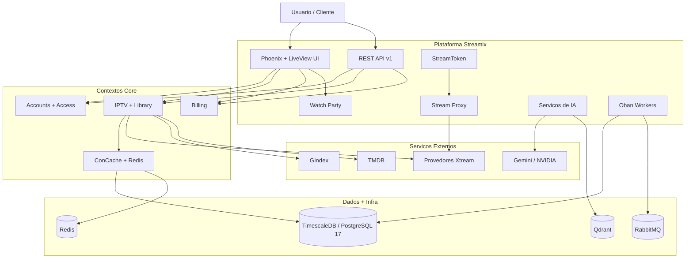
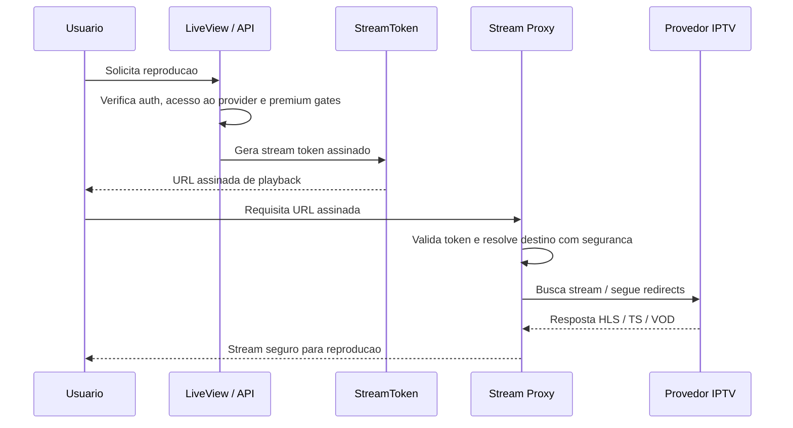

<h1 align="center">
  <br>
  
  <br>
  Streamix
  <br>
</h1>

<p align="center">
  <strong>Uma plataforma cinematografica em Phoenix + LiveView que unifica provedores Xtream Codes, catalogos opcionais via GIndex, acesso premium, watch parties e descoberta assistida por IA em uma unica experiencia polida.</strong>
</p>

<p align="center">
  <a href="README.md">English</a>
</p>

<p align="center">
  
  
  
  
  
  
  
  
  
  
</p>

<p align="center">
  <a href="#sparkles-destaques">Destaques</a>&nbsp;&nbsp;&nbsp;|&nbsp;&nbsp;&nbsp;
  <a href="#art-arquitetura">Arquitetura</a>&nbsp;&nbsp;&nbsp;|&nbsp;&nbsp;&nbsp;
  <a href="#rocket-superficies-em-runtime">Superficies</a>&nbsp;&nbsp;&nbsp;|&nbsp;&nbsp;&nbsp;
  <a href="#computer-stack">Stack</a>&nbsp;&nbsp;&nbsp;|&nbsp;&nbsp;&nbsp;
  <a href="#package-inicio-rapido">Inicio Rapido</a>&nbsp;&nbsp;&nbsp;|&nbsp;&nbsp;&nbsp;
  <a href="#memo-notas-do-projeto">Notas</a>
</p>

<br>

> [!NOTE]
> Este repositorio contem o backend Phoenix e a aplicacao web em LiveView. O frontend antigo de TV foi extraido para
> outro repositorio e nao faz mais parte desta base.

## :sparkles: Destaques

### Plataforma de Streaming Unificada

- **Agregacao multi-provedor** para catalogos Xtream Codes
- **Provedor global opcional** compartilhado pelo sistema
- **Ingestao opcional via GIndex** para bibliotecas em Google Drive
- **TV ao vivo, filmes, series, temporadas e episodios**
- **Favoritos, historico e progresso de reproducao**
- **Sincronizacao de EPG** com consultas de now/next

### Superficie de Produto Premium

- **Planos premium e assinaturas**
- **Painel administrativo** para planos e usuarios
- **Watch parties** com reproducao sincronizada e chat
- **Stream URLs assinadas** e entrega segura
- **Suporte a PWA** com hooks de sincronizacao offline
- **UI dark-first**

### IA, entrega e infraestrutura

- **Busca semantica** via embeddings Gemini ou NVIDIA + Qdrant
- **Recomendacoes e perfil de gosto** quando os servicos de IA estao configurados
- **Proxy Phoenix de streams** para mixed content e protecao de credenciais upstream
- **Multiplexador de canais ao vivo** para compartilhar consumo upstream
- **Circuit breaker** para provedores instaveis
- **Cache em duas camadas** com ConCache L1 + Redis L2
- **Background jobs com Oban**, com **RabbitMQ + Broadway** como caminho opcional

## :fire: Por Que o Streamix Tem Cara de Produto

O Streamix nao e apenas um wrapper de painel IPTV. O repositorio ja contem as pecas para se comportar como uma
superficie de produto de verdade: premium gate, stream tokens assinados, rooms sincronizadas, descoberta opcional por
IA e uma interface cinematografica em LiveView feita para navegar, nao apenas listar dados de provedor.

O sistema foi modelado para consolidar fontes upstream fragmentadas por tras de uma UX coerente e de um modelo de
dominio coerente. Por isso a base e opinativa sobre seguranca, entrega de stream, limites de provider e integracao com
servicos externos.

## :art: Arquitetura

### Visao Geral


```mermaid
graph TD
    U[Usuario / Cliente]

    subgraph Streamix["Plataforma Streamix"]
        W[Phoenix + LiveView UI]
        API[REST API v1]
        ST[StreamToken]
        SP[Stream Proxy]
        WP[Watch Party]
        AI[Servicos de IA]
        JOBS[Oban Workers]
    end

    subgraph Core["Contextos Core"]
        ACC[Accounts + Access]
        IPTV[IPTV + Library]
        BILL[Billing]
        CACHE[ConCache + Redis]
    end

    subgraph Data["Dados + Infra"]
        DB[(TimescaleDB / PostgreSQL 17)]
        REDIS[(Redis)]
        QDRANT[(Qdrant)]
        RMQ[(RabbitMQ)]
    end

    subgraph External["Servicos Externos"]
        XT[Provedores Xtream]
        GIDX[GIndex]
        TMDB[TMDB]
        EMB[Gemini / NVIDIA]
    end

    U --> W
    U --> API
    W --> ACC
    W --> IPTV
    W --> BILL
    W --> WP
    API --> ACC
    API --> IPTV
    API --> BILL
    IPTV --> CACHE
    CACHE --> DB
    CACHE --> REDIS
    ST --> SP
    SP --> XT
    IPTV --> XT
    IPTV --> GIDX
    IPTV --> TMDB
    AI --> EMB
    AI --> QDRANT
    JOBS --> DB
    JOBS --> RMQ
```

### Fluxo de Playback Protegido


```mermaid
sequenceDiagram
    participant Usuario
    participant UI as LiveView / API
    participant Token as StreamToken
    participant Proxy as Stream Proxy
    participant Upstream as Provedor IPTV

    Usuario->>UI: Solicita reproducao
    UI->>UI: Verifica auth, acesso ao provider e premium gates
    UI->>Token: Gera stream token assinado
    Token-->>Usuario: URL assinada de playback
    Usuario->>Proxy: Requisita URL assinada
    Proxy->>Proxy: Valida token e resolve destino com seguranca
    Proxy->>Upstream: Busca stream / segue redirects
    Upstream-->>Proxy: Resposta HLS / TS / VOD
    Proxy-->>Usuario: Stream seguro para reproducao
```

<details>
<summary><strong>Modulos centrais que valem conhecer</strong></summary>

| Area              | Modulos principais                                                                     |
|-------------------|----------------------------------------------------------------------------------------|
| Auth e papeis     | `Streamix.Accounts`, `Streamix.Access`                                                 |
| IPTV e catalogo   | `Streamix.Iptv`, `Streamix.Library`                                                    |
| Billing           | `Streamix.Billing`                                                                     |
| IA                | `Streamix.AI.SemanticSearch`, `Streamix.AI.UserAnalytics`                              |
| Rooms realtime    | `Streamix.WatchParty`, `Streamix.WatchParty.RoomServer`                                |
| Entrega de stream | `StreamixWeb.StreamToken`, `StreamixWeb.StreamController`, `Streamix.Iptv.StreamProxy` |
| Background jobs   | `Streamix.Workers.*`, `Oban`                                                           |
| Fila opcional     | `Streamix.Queue.*`                                                                     |

</details>

## :rocket: Superficies em Runtime

### Rotas web

- `/` landing page
- `/plans`
- `/login`, `/register`, `/settings`
- `/browse`, `/browse/movies`, `/browse/series`
- `/providers`, `/providers/:provider_id/...`
- `/favorites`, `/history`
- `/gindex/...`
- `/party`, `/party/:invite_code`, `/party/:invite_code/watch`
- `/watch/:type/:id`
- `/admin`, `/admin/plans`, `/admin/users`

### REST API

Superficies principais em `/api/v1`:

- `auth` - register, login, logout, me
- `catalog` - featured, movies, series, channels, categories, stream URLs
- `search` - busca semantica, similar, status, info
- `recommendations` - personalized, similar, channels, insights, refresh
- `favorites`
- `history`
- `epg`
- `telemetry/playback`
- `providers`

Healthcheck:

- `GET /api/health`

## :computer: Stack

### Backend

| Tecnologia  | Versao      | Papel                     |
|-------------|-------------|---------------------------|
| Elixir      | `~> 1.18`   | runtime da aplicacao      |
| OTP         | 27          | supervisao e concorrencia |
| Phoenix     | `~> 1.8.2`  | framework web             |
| LiveView    | `~> 1.1.0`  | UI em tempo real          |
| Ecto SQL    | `~> 3.13`   | camada de banco           |
| Req + Finch | deps atuais | cliente HTTP e pooling    |
| Oban        | `~> 2.18`   | background jobs           |

### Dados e infra

| Tecnologia                  | Status      | Papel                           |
|-----------------------------|-------------|---------------------------------|
| TimescaleDB / PostgreSQL 17 | obrigatorio | banco relacional principal      |
| Redis 7                     | recomendado | cache L2 e suporte a hot-path   |
| Qdrant                      | opcional    | busca semantica e recomendacoes |
| RabbitMQ 4                  | opcional    | fila distribuida com Broadway   |
| ConCache                    | embutido    | cache L1 em memoria             |

### Frontend

| Tecnologia                | Papel                                            |
|---------------------------|--------------------------------------------------|
| Tailwind CSS v4           | estilo                                           |
| esbuild                   | bundling JS                                      |
| pacotes npm em `assets/`  | dependencias do browser                          |
| manifest + service worker | instalacao como PWA e cache offline de metadados |

## :package: Inicio Rapido

### Pre-requisitos

- Docker
- Elixir 1.18+
- OTP 27+
- Node.js 20+ e npm

### 1. Suba a infraestrutura local

```bash
docker compose up -d
```

Servicos incluidos:

- TimescaleDB / PostgreSQL 17
- Redis
- RabbitMQ
- Qdrant

### 2. Configure o `.env`

```bash
cp .env.example .env
```

Valores minimos antes do `mix setup`:

- `ADMIN_PASSWORD`
- `PROVIDER_ENCRYPTION_KEY`

### 3. Instale as dependencias JS

```bash
cd assets && npm ci && cd ..
```

### 4. Prepare a aplicacao

```bash
mix setup
```

Isso executa deps, setup de banco, seeds, setup de assets e build de assets.

### 5. Rode o Streamix

```bash
mix phx.server
```

Abra [http://localhost:4000](http://localhost:4000).

<details>
<summary><strong>Checklist de ambiente</strong></summary>

Variaveis importantes em `.env.example`:

- `DATABASE_URL`
- `TEST_DATABASE_URL` opcional; inferido de `DATABASE_URL` quando omitido
- `REDIS_URL`
- `GLOBAL_PROVIDER_*`
- `GINDEX_ENABLED` / `GINDEX_URL`
- `TMDB_API_TOKEN`
- `GEMINI_API_KEY` ou `NVIDIA_API_KEY`
- `QDRANT_URL`
- `RABBITMQ_ENABLED`
- `API_KEYS`
- `SECRET_KEY_BASE` em producao
- `LIVE_VIEW_SIGNING_SALT` em producao

</details>

## :wrench: Comandos de Desenvolvimento

```bash
mix test
mix test path/to/test.exs
mix test path/to/test.exs:42

mix credo --strict
mix quality
mix precommit

mix ecto.migrate
mix ecto.reset

mix assets.build
mix assets.deploy
```

## :memo: Notas do Projeto

- O workflow atual do GitHub Actions faz build e push de `ghcr.io/gabrielmaialva33/streamix:latest` em pushes para
  `master`.
- `mix setup` depende de seeds, e os seeds exigem `ADMIN_PASSWORD`.
- `assets/node_modules` e ignorado, entao `npm ci` faz parte do setup real de primeira execucao.
- As features de IA sao opcionais e fazem degradação elegante quando embeddings ou Qdrant nao estao configurados.
- O TV app extraido esta intencionalmente fora do escopo deste repo.

## :handshake: Contribuicao, Seguranca, Licenca

- [CONTRIBUTING.md](CONTRIBUTING.md)
- [SECURITY.md](SECURITY.md)
- [AGENTS.md](AGENTS.md)
- [LICENSE](LICENSE)

<br>

<p align="center">
  
</p>

<p align="center">
  Criado por <strong>Gabriel Maia</strong><br>
  <a href="mailto:gabrielmaialva33@gmail.com">gabrielmaialva33@gmail.com</a> ·
  <a href="https://github.com/gabrielmaialva33">GitHub</a>
</p>
